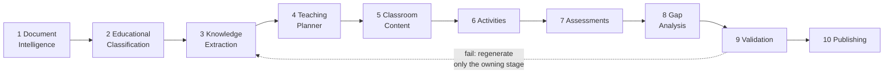

# EduForge AI

**Live: <https://eduforge-ai.azurewebsites.net>** · [API docs](https://eduforge-ai.azurewebsites.net/api/v1/docs) · [health](https://eduforge-ai.azurewebsites.net/healthz) · [samples](samples/)

Upload a chapter — PDF, DOCX, PPTX or text — and get back a **Teacher Knowledge
Package**: a multi-period lesson plan, teacher scripts, classroom activities, an
assessment bank with answer keys and rubrics, learning-gap analysis with
diagnostics and remediation, and a citation back to the source for every factual
claim.

A ten-stage pipeline does the work. The same code path handles a physics chapter
and a history chapter, and produces genuinely different material for each,
without anything in the system knowing what a "subject" is.

---

## Try it in two minutes

1. Open the [live app](https://eduforge-ai.azurewebsites.net).
2. **Open a sample** — two finished packages are preloaded, one Physics and one
   History. No upload, no waiting.
3. Or upload your own chapter and watch it run. A full run takes 5–7 minutes;
   refresh the page mid-run and the progress stream resumes where it left off.

> **Quota note.** The deployment uses OpenRouter's free tier: **50 model requests
> per day**, about one and a half full runs. A `429` mid-run is the quota, not a
> defect. The preloaded samples cost nothing and always work.

---

## What it produces

| Artifact | Contents |
|---|---|
| `TeacherKnowledgePackage.json` | The whole package, schema-versioned |
| Lesson Plan PDF | Per-period plan with timings and concept sequencing |
| Teacher Guide PDF | Scripts, activities, misconceptions, gaps, remediation |
| Assessment Book PDF | Questions, then the answer key behind a page break |
| Markdown bundle | The same content, plain text |

Schema: [`backend/contracts/schema/tkp-1.0.0.json`](backend/contracts/schema/tkp-1.0.0.json)
— generated from the Pydantic models and CI-checked for drift.

---

## The ten stages



| # | Stage | What it owns |
|---|---|---|
| 1 | Document Intelligence | Parse PDF/DOCX/PPTX/TXT, preserve structure, chunk |
| 2 | Educational Classification | Subject, grade band, difficulty, **pedagogy profile** |
| 3 | Knowledge Extraction | Concepts, objectives, definitions, formulae, misconceptions, concept DAG — every claim carrying verified evidence |
| 4 | Teaching Planner | Period count **derived**, concepts topologically sequenced |
| 5 | Classroom Content | Per-period scripts, explanations, checks for understanding |
| 6 | Activities | Profile-weighted activity mix, runnable from the page |
| 7 | Assessments | Blueprint-first bank, answer keys, discriminating rubrics |
| 8 | Gap Analysis | Predicted misconceptions, diagnostics, remediation |
| 9 | Validation | Schema, coverage, consistency, grounding — profile-conditioned |
| 10 | Publishing | Assemble and render the artifacts |

---

## How it adapts

**Everything downstream keys off `pedagogy_profile`** — `quantitative`,
`conceptual`, `narrative`, `procedural`, or `mixed` — which stage 2 derives from
the content. **No code anywhere branches on a subject name**; a test greps for
that and fails the build.

Every generation stage splits into a deterministic half that decides *structure*
and a model call that writes *prose*:

| Stage | Decided in Python | Written by the model |
|---|---|---|
| 4 · Planner | period count, concept order, time budget | period titles and framing |
| 6 · Activities | how many, what type, how long, which concepts | the activity itself |
| 7 · Assessments | item count, kinds, Bloom levels, marks, coverage | stems, distractors, answers, rubrics |
| 8 · Gaps | which gaps exist, and their severity | misconception, diagnostic, remediation |

That is why absence is reliable rather than lucky: a narrative profile weights
`numerical` at zero, so **no numerical item is ever requested**.

Measured on the deployed instance, both documents through the same code path:

| | `physics.pdf` | `history.docx` |
|---|---|---|
| Subject → profile | Physics → `quantitative` | History → `narrative` |
| Formulae | 1 | **0** |
| Assessment mix | 3 numerical, 2 mcq, 1 long, 1 short | **0 numerical**, 1 mcq, 3 long, 2 short |
| Activity chosen | `experiment` | `debate` |

### Curriculum boards

A board configures the output, it does not merely label it. Profile and board
**compose by multiplication**, then renormalise:

```
effective mix = profile.assessment_mix × board.assessment_bias
```

| | generic | CBSE | ICSE |
|---|---|---|---|
| Quantitative | 6 numerical, 4 mcq, 43 marks | **6 mcq**, 5 num, 41 marks | **3 long**, 2 mcq, **69 marks** |
| Narrative | 0 numerical | 0 numerical | 0 numerical |

Multiplying is the point: zero times any bias is still zero, so **no board can
put a numerical question in a poetry chapter**. A board shifts emphasis inside
what the content affords; it cannot contradict it. Boards live in
[`backend/pedagogy/curricula.yaml`](backend/pedagogy/curricula.yaml) — adding one
is a config block, not a conditional.

---

## Running it locally

Requires Python 3.12+ and Node 18+. On Windows, run everything through WSL.

```bash
git clone <this repo> && cd EduForge-AI

python3 -m venv .venv
./.venv/bin/python -m pip install -e "backend[dev]"

cp .env.example .env          # add ONE provider key — see below
make check                    # lint + boundaries + tests + schema drift
make dev                      # http://localhost:8000
```

The frontend is served by the API itself:

```bash
cd frontend && npm install && npm run build
```

### Provider configuration

```bash
LLM_PROFILE=production        # OpenRouter free models — the default
Open_Router_API_KEY=sk-or-...
```

Free key at [openrouter.ai](https://openrouter.ai/keys). The default profile uses
only `:free` models, so a run costs **$0.00**.

| `LLM_PROFILE` | Provider | Use |
|---|---|---|
| `production` | OpenRouter (free) | Graded output, the deployment |
| `dev` | OpenRouter (smallest) | Fast single-stage iteration |
| `groq` / `gemini_dev` | Groq / Gemini | Alternatives |
| `ci` | replay | Recorded cassettes — no network, no key |

Anthropic is implemented but **off by default**: a key in the environment is not
enough, `ALLOW_ANTHROPIC=true` is also required. Billing against a key should be
a decision, not a config typo.

### Commands

```bash
make check         # what CI runs: schema drift + lint + boundaries + tests
make boundaries    # import-linter — a stage importing a stage fails here
make evals         # score the reference packages on the 9-dimension rubric
make samples       # regenerate samples/ from the fixtures
make dev           # run the API (also serves the built frontend)
make docker-build  # build the production image
```

There is no separate worker command: until the Postgres store lands, an in-memory
store cannot be shared across processes, so the API drives the pipeline itself.

---

## API

Base path `/api/v1`. Full spec at [`/api/v1/docs`](https://eduforge-ai.azurewebsites.net/api/v1/docs).

| Method | Path | Purpose |
|---|---|---|
| `POST` | `/documents` | Upload (multipart), deduplicated by SHA-256 |
| `POST` | `/jobs` | Enqueue a run — returns `202` immediately |
| `GET` | `/jobs/{id}` | Snapshot: status, progress, completed stages |
| `GET` | `/jobs/{id}/events` | **SSE** progress, resumable via `Last-Event-ID` |
| `POST` | `/jobs/{id}/retry` | Resume from the first incomplete stage |
| `GET` | `/packages/{id}` | The package |
| `GET` | `/packages/{id}/artifacts` | Rendered artifacts + download URLs |
| `GET` | `/samples` | Preloaded reference packages |
| `GET` | `/options` | Boards, teaching styles, artifact kinds |
| `GET` | `/healthz` `/readyz` `/metrics` | Ops |

**Every failure uses one envelope**, including a `trace_id` that matches the
`X-Request-ID` header and the structured logs:

```json
{"error": {"code": "document_not_found", "message": "…", "trace_id": "c1a666c5d2c9"}}
```

---

## Architecture

**Modular monolith with enforced boundaries**, not ten microservices.
`make boundaries` fails the build if one stage imports another, if anything
imports *into* `contracts`, or if a layer reaches upward. 85% of the grade is
output quality; the live prototype was the real delivery risk. Boundaries keep
the option of splitting later without paying for distribution now.

```
backend/
  contracts/      frozen Pydantic models + published JSON Schema (imports nothing else)
  core/           LLM client & providers, storage, progress, observability, config
  pedagogy/       pedagogy profiles + curriculum boards (declarative YAML)
  stages/         s1…s10, one package each — never import one another
  orchestration/  LangGraph topology, state, checkpointing, the stage roster
  worker/         job execution and resume
  api/            FastAPI routes, SSE, middleware
  evals/          9-dimension quality rubric
frontend/         React + TypeScript + Vite, served single-origin by the API
docs/             SRS, HLD, LLD, data model, agent graph, API spec, design system
samples/          two published packages + PDFs + eval reports — start here
```

### Five decisions that shape everything

1. **Evidence spans are mandatory from stage 3.** `Grounded.evidence` has
   `min_length=1`, so an ungrounded claim is *unconstructable*. Hallucination
   detection and RAG traceability become one subsystem instead of two half-built
   ones.

2. **Citations are verified deterministically** before any judge model runs.
   Claims quoting text their cited chunk does not contain are dropped — free, and
   it stops a fabrication propagating through six downstream stages.

3. **`pedagogy_profile` routing**, described above.

4. **Durable jobs + a persisted event log with SSE replay.** The pipeline
   outlives the HTTP request, a browser refresh, and a worker restart.

5. **Our own checkpointing, not LangGraph's saver.** One source of truth for
   "what has this job completed" beats two that can disagree at minute nine of a
   twelve-minute run.

More in [`docs/`](docs/) — [SRS](docs/01-srs.md), [HLD](docs/02-hld.md),
[LLD](docs/03-lld.md), [data model](docs/04-data-model.md),
[agent graph](docs/05-agent-graph.md), [API spec](docs/06-api-spec.md),
[design system](docs/14-design-system.md),
[Azure deployment](docs/13-azure-deployment.md).

---

## Quality evaluation

`make evals` scores a package on **nine dimensions, all deterministic** —
objectives, Bloom distribution, coverage, sequencing, grounding, activities,
differentiation, assessment integrity, classroom content. An LLM judge is
optional and never load-bearing.

The tests are about *discrimination*, not about the good package scoring well: a
package sabotaged four ways scores **0.917 → 0.668**, each sabotage lands on the
dimension that owns it, and coverage and sequencing do not move.

The property that matters most is that a humanities package is **not** marked
down for absent STEM content. Coverage is identical across both profiles. A
grader that rewarded subject shape would push the whole system toward producing
it, and no other test here would notice.

---

## Testing

```bash
make check     # 296 tests, no network, no API key, no model calls
```

Document fixtures are *real* generated PDF/DOCX/PPTX files — parser behaviour
against synthetic input proves nothing. Tests worth knowing about:

- Corrupted packages must trip **each** validation rule class; a validator only
  ever tested on good input is indistinguishable from `return "pass"`.
- Kill the worker mid-run: the job resumes at the first incomplete stage and does
  not re-bill completed ones.
- Cut the SSE stream, reconnect with `Last-Event-ID`, assert the halves join
  exactly — no gap, no duplicate.
- A narrative package with zero formulae is asserted **valid**.
- No board can introduce a numerical item into narrative content.

---

## Observability

- **Structured JSON logs**, one object per line, with `request_id`, `job_id` and
  `stage` merged in automatically via contextvars.
- **`/metrics`** in Prometheus format: requests, job outcomes, stage durations,
  and model calls by outcome — failures included, since a climbing retry rate is
  the earliest sign a provider or prompt has degraded.
- **`trace_id`** on every error response, matching `X-Request-ID` and the logs.
  An inbound request id from a proxy is honoured rather than renamed.

---

## Known limitations

- **Storage is in-memory.** A restart loses uploaded documents, jobs and
  packages. The Postgres implementation sits behind the same interface and is
  not written. This is also why the deployment runs a single instance.
- **The UI redesign is specified but not built.** [`docs/14-design-system.md`](docs/14-design-system.md)
  and the design tokens are committed; the landing page and responsive layout are
  not yet implemented, so the current UI is functional but desktop-oriented.
- **Free-tier quota** — 50 requests/day, roughly 1.5 runs.
- Devanagari **glyphs** render correctly (verified by round-tripping text back
  out of the PDF), but complex-script shaping uses fpdf2's own engine rather than
  HarfBuzz, so conjuncts are not typographically perfect.
- Scanned PDFs are rejected with a clear error rather than OCR'd.
- Per-stage token/cost provenance is empty: no stage threads its usage back into
  graph state, so publishing has nothing honest to report there.

---

## License

Assignment submission. Noto fonts under the SIL Open Font License.
