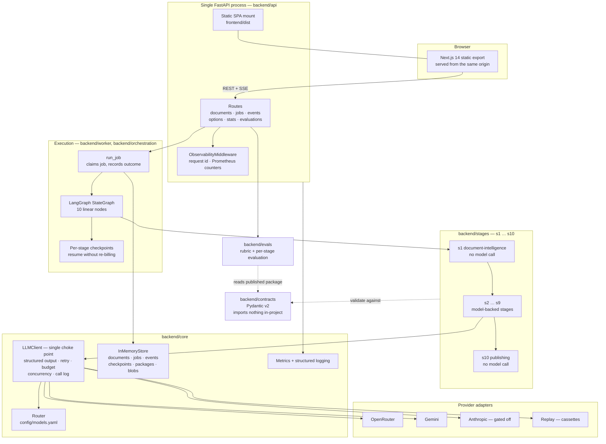
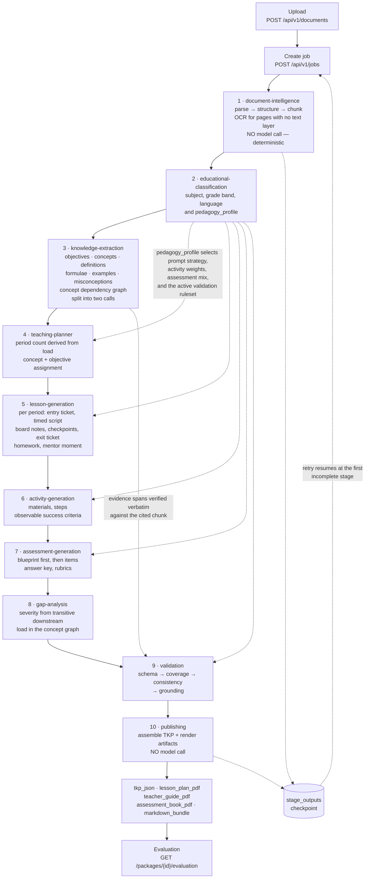
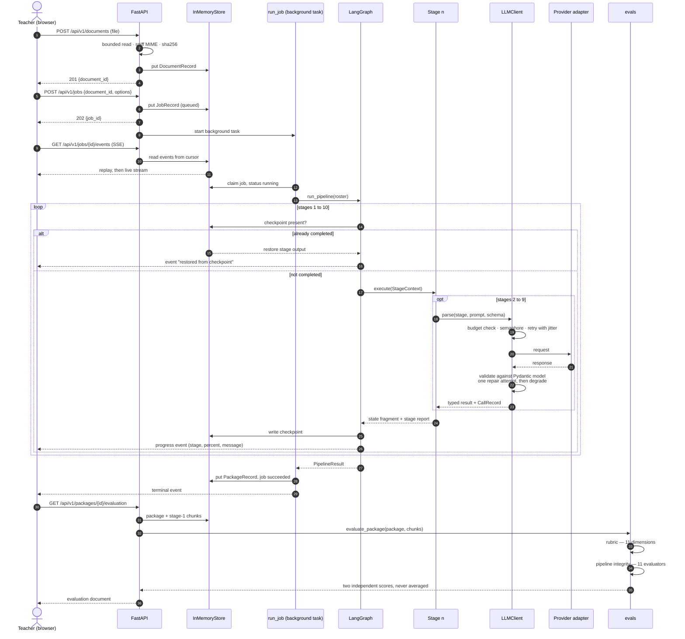

# EduForge AI

[](https://www.python.org/)
[](https://fastapi.tiangolo.com/)
[](https://langchain-ai.github.io/langgraph/)
[](https://docs.pydantic.dev/)
[](https://nextjs.org/)
[](https://www.typescriptlang.org/)
[](https://tailwindcss.com/)
[](https://eduforge-ai.azurewebsites.net)

Deployment: <https://eduforge-ai.azurewebsites.net> ·
[API docs](https://eduforge-ai.azurewebsites.net/api/v1/docs) ·
[health](https://eduforge-ai.azurewebsites.net/healthz)

---

## 1. Project Overview

EduForge AI converts one uploaded educational document (PDF, DOCX, PPTX, or
plain text) into a **Teacher Knowledge Package (TKP)** — a single validated JSON
artifact plus rendered PDFs containing a multi-period lesson plan, per-period
teacher scripts, classroom activities, an assessment bank with answer key and
rubrics, learning-gap analysis, and a source citation for every extracted
factual claim.

The work is done by a **ten-stage LangGraph pipeline**. Stage names are fixed in
`backend/contracts/primitives.py::STAGE_NAMES` and are the single contract shared
by the graph nodes, the progress event stream, and the checkpoint store.

Two properties are worth pointing a reviewer at directly:

| Property | Where it is enforced |
|---|---|
| No stage branches on a subject name; all adaptation flows through `pedagogy_profile` | `backend/pedagogy/profiles.yaml`; test `backend/tests/unit/test_knowledge_core.py::test_no_stage_branches_on_a_subject_name` scans every file under `backend/stages/` for subject-name conditionals |
| An ungrounded claim is not constructible | `Grounded.evidence` has `min_length=1` in `backend/contracts/primitives.py` |

---

## 2. Problem Statement & Objectives

A teacher handed a textbook chapter must independently derive learning
objectives, decide how many periods the material needs, write scripts and board
notes, design activities, build an assessment with a marking scheme, and
anticipate where students will get stuck. That work repeats per chapter, per
teacher, per year.

**Objectives, and how each is realised:**

| Objective | Implementation |
|---|---|
| Ingest a real document, including scanned pages | Stage 1: four parsers (`pypdf`/`pdfplumber`, `python-docx`, `python-pptx`, plain text) plus an OCR port with three engines |
| Produce classroom-usable material, not a summary | Stages 4-8 produce per-period scripts, activities, assessments, and gap remediation |
| Work across subjects without subject-specific code | `pedagogy_profile` routing over five values: `quantitative`, `conceptual`, `narrative`, `procedural`, `mixed` |
| Make every factual claim traceable to the source | Type-level mandatory evidence spans plus deterministic verbatim verification |
| Be able to state, with evidence, whether the output is good | Two independent evaluation systems (Section 5) |
| Fail visibly rather than silently | `StrictModel` forbids extra fields; unmeasurable metrics carry no score |

**Non-objectives (deliberately out of scope):** multi-document ingestion,
multi-tenant authentication, durable storage, and student-facing features.

---

## 3. System Architecture



**Module boundaries are machine-enforced** by `import-linter`
(`backend/pyproject.toml`, `[tool.importlinter]`), with three contracts:

| Contract | Rule |
|---|---|
| `contracts is a leaf` | `contracts` may import nothing else in-project |
| `stages are independent of each other` | `stages.sN_*` may not import `stages.sM_*` |
| `layered architecture` | `api → worker → orchestration → stages → pedagogy → core → contracts`, one direction only |

`api` sits above `worker` rather than beside it, because until a durable store
exists there is no separate worker process to hand off to — the API enqueues and
then drives `run_job` itself as a background task. The contract declares the
architecture that exists rather than the one that is planned.

---

## 4. End-to-End AI Pipeline



**Grounding, end to end.** Stage 3 requires a verbatim quote plus a chunk id on
every extracted item (`Grounded.evidence`, `min_length=1`). Quotes are normalised
for PDF extraction artefacts (NFKD, quote and dash folding, whitespace collapse)
and then checked for containment in the chunk they cite
(`backend/stages/s3_knowledge/grounding.py`, `FUZZY_THRESHOLD = 0.88`). Items
that fail are dropped before any downstream stage sees them. Stage 9 then runs
the semantic check on the survivors: lexical overlap at or above `TAU_HIGH`
auto-passes without a model call *unless* `contradiction_risk` fires; everything
else is batched to an LLM judge. The auto-pass is deliberately one-directional —
low overlap means paraphrase, not fabrication, and treating it as fabrication
reported four of seven claims in the reference package as hallucinations that
nothing had read.

**Prompt-injection handling.** Document text is wrapped in a `<document_content>`
block that the document itself cannot close early, and is declared to the model
as data rather than instruction (asserted in
`backend/tests/unit/test_knowledge_core.py`).

---

## 5. Evaluation Framework

This is the section to read first if you are grading the project.

There are **two independent evaluation systems**. They are not two views of one
number; they answer different questions and are computed by different code.

| | Educational Quality Rubric | Pipeline Integrity Evaluation |
|---|---|---|
| Code | `backend/evals/dimensions/` | `backend/evals/stagewise.py` |
| Question | *Is the finished package good teaching?* | *Did each stage meet its contract with the next?* |
| Input | The published TKP, plus source chunks when available | The published TKP, plus source chunks when available |
| Unit | 11 weighted dimensions | 11 evaluators — the 10 pipeline stages plus a cross-cutting `outcomes` evaluator |
| Output scale | 0.0-1.0, mapped to a named band | 0-100 per stage, confidence-weighted |
| Uses a model? | Only for `hybrid` dimensions, and only under `LLM_PROFILE=production` | Almost entirely arithmetic |

### 5.1 The two scores are independent and never averaged

`backend/evals/service.py::evaluate_package` runs both and returns both in one
document, side by side, as `summary.rubric_score` and `summary.stage_score`. The
code states why at the exact point a lazier implementation would have blended
them:

> Two numbers, and they answer different questions. The stage score is "did the
> machinery work"; the rubric score is "is the teaching any good". Averaging them
> together would produce a third number that answers neither.

A package can have flawless pipeline integrity — every reference resolving, every
field populated — and still be poor teaching. A single blended number hides that
case in both directions.

### 5.2 Rubric dimensions and weights

Verified by running, from `backend/`:

```bash
../.venv/bin/python -c "from evals.dimensions import DIMENSIONS; [print(d.weight, d.key, d.method) for d in DIMENSIONS]"
```

| Weight | Dimension | Method | What it asks |
|---:|---|---|---|
| 0.15 | `assessment_integrity` | deterministic | Do items have a key, do rubric levels discriminate, is the mark scheme coherent |
| 0.15 | `classroom` | deterministic | Could a teacher run this from the page — scripts, board notes, timings, tickets |
| 0.12 | `coverage` | deterministic | Is everything taught also practised and assessed |
| 0.12 | `grounding` | deterministic | Does every claim carry evidence that appears in the chunk it cites |
| 0.11 | `content_fidelity` | deterministic | Is the package actually about the document it claims |
| 0.08 | `objectives` | hybrid | Are objectives observable and measurable rather than topic restatements |
| 0.07 | `activities` | hybrid | Variety, real materials, runnable instructions |
| 0.06 | `sequencing` | deterministic | Is anything taught before its own prerequisite; is per-period load sane |
| 0.05 | `bloom` | deterministic | Mark distribution across Bloom levels |
| 0.05 | `period_integrity` | deterministic | Are periods distinct rather than copies of period 1 |
| 0.04 | `differentiation` | hybrid | Is support and extension specific to this content |
| **1.00** | | | Weights are asserted to sum to 1.0 at import time |

`hybrid` means deterministic by default, with an optional judged component that
engages only when judgements are supplied
(`backend/evals/types.py::Method`).

Score bands (`backend/evals/types.py::BANDS`), named for what a teacher would do
with the package rather than as letter grades:

| Floor | Band |
|---:|---|
| 0.85 | exemplary |
| 0.70 | classroom-ready |
| 0.55 | usable with edits |
| 0.35 | needs rework |
| 0.00 | not classroom-usable |

**Profile-conditioned expectations.** `backend/evals/expectations.yaml` holds what
a profile owes *a reviewer* — recall-mark ceilings, higher-order floors,
per-period cognitive load. What a profile owes *the generator* — item kinds,
activity types, required knowledge fields — is read from
`backend/pedagogy/profiles.yaml`, so the eval and the generator share one source
of truth rather than two copies that drift. A narrative package with zero
formulae and zero numerical items is recorded as `absent_by_design` and scored as
correct, not as missing.

### 5.3 Pipeline integrity metric categories

`stagewise.py` recurs on three kinds of check:

| Category | Question | Example |
|---|---|---|
| **Completeness** | Did the stage fill in what it owes? | Fraction of concepts carrying evidence; fraction of items carrying an answer key |
| **Referential integrity** | Do the identifiers it emitted resolve? | An `activity_ref` pointing at no activity; a `concept_id` the knowledge base never extracted |
| **Self-consistency** | Does the stage's own report of its work survive recomputation? | Stage 9 publishes a coverage summary; the evaluator recomputes it from the package and compares |

Self-consistency is the class that catches real bugs, because it is the only one
the generating stage cannot satisfy by construction.

### 5.4 Metric types: Measured, Judged, Not Measurable

Every metric declares how its number was arrived at
(`backend/evals/framework.py::Measurability`):

| Type | Meaning | Score | Confidence |
|---|---|---|---|
| `MEASURED` | Computed from the artifact by arithmetic. Reproducible, no model involved. | Required | Up to 1.0 |
| `JUDGED` | A model read it and scored it, carrying its reasoning as evidence. | Required | Capped at 0.9 — a judge is an instrument with error |
| `NOT_MEASURABLE` | No ground truth exists, or the data is not there. | **None** | 0.0 |

**A `NOT_MEASURABLE` metric carries no score and is EXCLUDED from every
aggregate. It is not counted as zero, and not counted as perfect.** Both
alternatives are false: zero says "this failed", perfect says "this passed", and
the truth is "this was not measured". Examples in the codebase include subject
classification accuracy (needs a labelled corpus this project does not have) and
student learning effectiveness (needs students).

The distinction is enforced at the type level, not by convention.
`MetricResult._score_matches_measurability` is a Pydantic `model_validator` that
**rejects construction** of a `NOT_MEASURABLE` metric carrying a score:

```
f"{self.key!r} is NOT_MEASURABLE but carries a score of {self.score}. "
"An unmeasurable metric must report no number — inventing one is the "
"failure this type exists to make impossible."
```

The same validator rejects a `MEASURED` or `JUDGED` metric with **no** score, and
a `JUDGED` metric claiming confidence above 0.9.

Consequences that propagate upward:

- `StageEvaluation.score` is a **confidence-weighted** mean over only the scored
  metrics, and is `None` — not 0 — when nothing in that stage was measurable.
- `StageEvaluation.confidence` is deliberately penalised by coverage:
  `mean_confidence × (scored metrics ÷ all metrics)`. A stage where three of ten
  metrics could not be measured is a stage we know less about, and the number
  says so instead of showing a confident average of the seven that worked.
- `aggregate()` reports `stages_scored` alongside `stages_total`, so a reviewer
  can tell an overall computed from six of eleven stages from one computed from
  all eleven.
- `evaluate_package` returns a `not_measurable` list gathering every unscored
  metric with its stated reason, and the `not_measurable(...)` constructor takes
  a `needed` argument recording what it would take to measure it — turning a gap
  into a next step rather than a shrug.

### 5.5 Score format

Every metric reports the same five things
(`backend/evals/framework.py::MetricResult`):

**Score • Confidence • Reasoning • Evidence • Recommendations**

| Field | Contract |
|---|---|
| `score` | 0-100, or `None` for `NOT_MEASURABLE` |
| `confidence` | 0-1; never 1.0 for a judged metric |
| `reasoning` | Required, `min_length=1` — why this number, in one or two sentences |
| `evidence` | List of `{path, observation}`, where `path` is a **JSON pointer into the package** so a reader can go and look. A score whose evidence cannot be located is an assertion |
| `recommendations` | List of `{action, impact, severity}`. `impact` is required, so twenty fixes arrive ordered rather than as an unordered list nobody works through |

Recommendations from all stages are collected and sorted worst-first by severity,
then by how far the owning metric fell, then by pipeline order — an early stage's
defect propagates, so it should be fixed first.

### 5.6 Testing the rubric against itself — `backend/evals/degradations.py`

A rubric that nothing checks is a rubric nobody can trust. `degradations.py`
takes a known-good package, **sabotages it 15 different ways**, and asserts a
minimum score drop for each.

**Why it exists.** The rubric this replaced failed a test nobody had run.
Measured on a shipped package:

| Package state | Score |
|---|---:|
| baseline | 0.9167 |
| vacuous rubric descriptors | 0.9210 — **+0.0043, better** |
| filler speaker notes | 0.9217 — **+0.0050, better** |
| concept graph deleted entirely | 0.9167 — **no change at all** |

Total spread across every degradation: **0.011**, with two sabotages *raising*
the score. The cause was structural: the rubric's substance tests were word-count
minimums (`MIN_DESCRIPTOR_WORDS = 5`, `MIN_NOTE_WORDS = 8`), and the failure mode
being measured is padding, which is long by construction. The instrument was
handing the generator a gradient pointing straight at more words. Any prompt
tuned against it would have been tuned toward padding and would have looked like
progress the whole way down.

**The fix was two-part**, and both parts are in the repository:

1. `backend/evals/discrimination.py` replaced the length proxies with checks
   length cannot pass — do adjacent rubric levels differ in the *substance* they
   claim once function words and evaluative adjectives are stripped; does a
   speaker note contain an imperative *and* name something this package teaches;
   is an instruction anchored to the package's own vocabulary rather than merely
   containing a digit or a colon.
2. `degradations.py` makes the instrument adversarially testable. If a future
   prompt change, threshold tweak, or new dimension makes a sabotage cheap again,
   the assertion fails and names it.

**The 15 degradations**, with the minimum required score drop by severity —
severe `0.05`, moderate `0.02`, minor `0.01`, plus a floor of
`MIN_ANY_DEGRADATION = 0.005` that applies to every entry regardless, so no
sabotage may ever improve a score or leave it untouched:

| Severity | Count | Keys |
|---|---:|---|
| severe | 9 | `off_topic_content`, `dangling_concept_references`, `vacuous_rubrics`, `filler_speaker_notes`, `duplicated_periods`, `stripped_citations`, `fabricated_citations`, `inverted_prerequisites`, `topic_restating_objectives` |
| moderate | 5 | `deleted_concept_graph`, `all_recall_bloom`, `nonsense_distractors`, `generic_differentiation`, `unobservable_success_criteria` |
| minor | 1 | `prose_board_notes` |

Each entry also declares which dimensions are *expected* to notice, and that is
checked — a degradation cannot pass by moving an unrelated dimension. The `minor`
tier exists rather than inflating a weight to make an assertion pass: prose board
notes touch one metric in one dimension, and weighting blackboard formatting as
heavily as whether the package is about the right subject would make the rubric
describe nothing.

**No degradation names a subject.** They operate on structure — rubric levels,
speaker notes, concept ids, the classification topic — so the same suite runs
against a mechanics package and a poetry package and asserts the same properties.

### 5.7 Guardrails on the evaluation itself

| Guardrail | Where |
|---|---|
| Judged scores refuse to run outside `LLM_PROFILE=production`; every report records the profile it was produced under and exposes `transferable` | `evals/harness.py::require_eval_profile` |
| The deterministic pass is pure — same package in, same numbers out, no network, no model, no clock | `evals/harness.py::evaluate` |
| No dimension key, stage key, or degradation key may name a subject | `test_no_dimension_key_names_a_subject`, `test_no_stage_key_names_a_subject`, `test_no_degradation_names_a_subject` |
| The subject name is reported and never scored | `test_the_subject_name_is_reported_and_never_scored` |
| Regression detection refuses a verdict on thin or non-comparable history, returning `insufficient_history` with the count | `evals/store.py` |
| The CLI exits 1 on a **high-severity recommendation**, not on a score threshold — a threshold on an aggregate invites tuning the aggregate | `evals/__main__.py` |

### 5.8 Running the evaluation

```bash
# The suites that prove the harness discriminates, including the degradation suite
make evals

# Score a directory containing teacher_knowledge_package.json
cd backend && ../.venv/bin/python -m evals score ../samples/quantitative-physics
cd backend && ../.venv/bin/python -m evals score ../samples/*/ --format markdown
cd backend && ../.venv/bin/python -m evals score <dir> --pdf report.pdf
```

Placing a `chunks.json` beside the package unlocks the citation-integrity checks.
Without it those metrics report themselves `NOT_MEASURABLE` rather than scoring
zero, because "we could not check" and "it failed" are different findings and
only one of them is a defect.

---

## 6. Technology Stack

| Layer | Choice | Notes |
|---|---|---|
| Language | Python 3.12+ | `requires-python = ">=3.12"` |
| Contracts | Pydantic v2 | `StrictModel` sets `extra="forbid"` and `validate_assignment=True` |
| API | FastAPI + Uvicorn, `sse-starlette` | Single process, single origin, so no CORS configuration exists |
| Orchestration | LangGraph `StateGraph` | Linear 10-node graph built from the stage roster, not hand-wired |
| Parsing | `pypdf`, `pdfplumber`, `python-docx`, `python-pptx`, `pymupdf` | PyMuPDF does page profiling and rasterisation for OCR routing |
| OCR | Azure Document Intelligence, Tesseract, EasyOCR | Behind one port; swappable by config |
| Rendering | `fpdf2` | Pure Python — no wkhtmltopdf, no LaTeX, no system packages |
| Eval history | `sqlite3` (standard library) | No added dependency |
| Frontend | Next.js 14 (`output: "export"`), React 18, TypeScript 5, Tailwind 3, Radix UI, TanStack Query, Recharts, Zustand | Static export to `frontend/dist`, served by the same FastAPI process |
| Tooling | `ruff`, `mypy`, `import-linter`, `pytest` + `pytest-asyncio` | All wired into `make check` |
| Deployment | Docker, Azure App Service | `Dockerfile` builds the frontend in an earlier stage |

**LLM providers implemented** (`backend/core/llm/providers/`):

| Provider | Adapter | Status |
|---|---|---|
| OpenRouter | `openrouter_provider.py` | Default. Hosted, open-weight `:free` models. Needs `Open_Router_API_KEY` |
| Gemini | `gemini_provider.py` | Needs `GEMINI_API_KEY` |
| Anthropic | `anthropic_provider.py` | Implemented but **gated off** — a key alone is not enough, `ALLOW_ANTHROPIC=true` is also required, so billing is a decision rather than a config typo |
| Replay | `replay_provider.py` | Serves recorded cassettes keyed by a hash of (stage, model, prompt). A cache miss is a hard failure, never a live call. Used by CI |

Groq and Ollama are not supported providers; both adapters were removed. A
local Ollama profile was built and then withdrawn after measurement: on the
target hardware (8 CPU cores, 7.6 GB RAM, no GPU) it sustained 3.5 output
tokens/second, which is roughly 14 minutes for a single knowledge-extraction
call against ~40 calls per chapter. It is retained in git history rather than
as a profile that cannot finish a run.

**Model routing** lives in `config/models.yaml`, never as a constant inside a
stage. A stage asks for a stage name and receives a `ModelSpec`; it never learns
which provider answered. Inheritance is two-level: a stage entry overrides
individual fields of its profile's `default`, and anything omitted is inherited.

| Profile in `models.yaml` | Provider | Selectable via `LLM_PROFILE`? |
|---|---|---|
| `production` | openrouter | Yes |
| `dev` | openrouter | Yes |
| `ci` | replay | Yes |
| `gemini_dev` | gemini | **No** — absent from the `LLMProfile` literal in `backend/core/config.py` |
| `anthropic` | anthropic | **No** — same reason, and additionally gated by `ALLOW_ANTHROPIC` |

`LLMProfile = Literal["production", "dev", "ci"]` in `config.py` is the
authority. The last two profiles are defined in YAML but cannot currently be
selected through settings; this is a known inconsistency between
`config/models.yaml`, `.env.example`, and `backend/core/config.py`.

---

## 7. Project Structure

```
EduForge-AI/
├── backend/
│   ├── contracts/          Pydantic contracts. Imports nothing else in-project.
│   │   ├── primitives.py     StrictModel, Grounded, Evidence, STAGE_NAMES,
│   │   │                     PedagogyProfile, SCHEMA_VERSION
│   │   ├── tkp.py            TeacherKnowledgePackage + cross-reference validator
│   │   ├── document.py  classification.py  knowledge.py  plan.py
│   │   ├── content.py   assessment.py      gaps.py       validation.py
│   │   ├── jobs.py           ArtifactKind, DocumentKind, TeachingStyle,
│   │   │                     JobStatus, STAGE_PROGRESS_WEIGHTS
│   │   ├── llm.py            ModelSpec, ProviderRouting, LLMResult, LLMUsage
│   │   └── schema/           Generated JSON Schema (drift-checked in CI)
│   ├── core/
│   │   ├── config.py         Settings — the source of truth for env vars
│   │   ├── llm/              client.py (choke point), router.py, factory.py,
│   │   │                     providers/
│   │   ├── storage/          base.py (Store port), memory.py (InMemoryStore)
│   │   ├── progress/         SSE event emitter
│   │   └── obs/              metrics.py, logging.py, context.py
│   ├── pedagogy/
│   │   ├── profiles.yaml     The versatility mechanism: per-profile emphasis,
│   │   │                     activity weights, assessment mix, validation rules
│   │   ├── curricula.yaml    Curriculum boards (generic, CBSE, ICSE, …)
│   │   └── registry.py  curriculum.py
│   ├── stages/
│   │   ├── base.py           Stage interface + StageContext
│   │   ├── s1_document_intelligence/  parsers.py, structure.py, chunking.py,
│   │   │                              ocr/{base,engines,detect}.py
│   │   ├── s2_classification/ … s8_gaps/
│   │   ├── s9_validation/    grounding.py + the four rule classes
│   │   └── s10_publishing/   assemble.py, render/ (fpdf2 + Noto fonts)
│   ├── orchestration/        graph.py (LangGraph), pipeline.py (roster), state.py
│   ├── worker/runner.py      run_job — the only mutator of job status
│   ├── api/
│   │   ├── main.py           App factory, error envelope, /healthz, /readyz,
│   │   │                     /metrics, SPA mount
│   │   ├── deps.py  middleware.py  samples.py
│   │   └── routes/           documents · jobs · events · options · stats ·
│   │                         evaluations
│   ├── evals/                ← Section 5
│   │   ├── dimensions/       The 11-dimension educational quality rubric
│   │   ├── stagewise.py      Per-stage pipeline integrity evaluators
│   │   ├── framework.py      MetricResult, Measurability, StageEvaluation
│   │   ├── degradations.py   15 sabotages + minimum required score drop
│   │   ├── discrimination.py Substance checks that replaced word-count proxies
│   │   ├── harness.py  service.py  judge.py  store.py  report.py  export.py
│   │   ├── expectations.yaml Profile-conditioned reviewer expectations
│   │   └── __main__.py       python -m evals score|benchmark
│   ├── tests/                contract/ (40) · unit/ (425) · integration/ (78)
│   └── pyproject.toml        Deps, extras, ruff/mypy/import-linter config
├── frontend/                 Next.js 14 static export → frontend/dist
├── config/models.yaml        Per-stage model routing
├── scripts/                  capture_sample.py, smoke_pipeline.py,
│                             generate_schema.py, check_repo_hygiene.py
├── docs/                     00-14 design set (see Section 16)
├── samples/                  Capture target — currently holds only README.md
├── Makefile  Dockerfile  docker-compose.yml  .env.example
```

---

## 8. Installation & Setup

Prerequisites: Python 3.12+, `make`, and Node 18+ only if you want the UI.

The virtualenv lives at `./.venv` and the `Makefile` targets it by path. From
Windows, drive everything through WSL:
`wsl -e bash -lc "cd ~/EduForge-AI && make check"`.

**Step 1 — clone and install the backend**

```bash
git clone https://github.com/23f3001800/EduForge-AI.git
cd EduForge-AI
make install          # creates ./.venv and installs backend[dev]
```

`make install` installs only the `dev` extra. For a run that actually processes a
document, install the runtime extras too:

```bash
./.venv/bin/python -m pip install -e "backend[dev,api,llm,parsing,render,ocr]"
```

**Step 2 — configure the environment**

```bash
cp .env.example .env
```

Then choose one of:

| Goal | Settings | Key needed |
|---|---|---|
| Run the test suite, no network | `LLM_PROFILE=ci` | none — replay cassettes |
| Full run against hosted models | `LLM_PROFILE=production` and `Open_Router_API_KEY=…` | free key from <https://openrouter.ai/keys> |

Boot fails immediately, with a message naming the missing key, if `production`
or `dev` is selected without `Open_Router_API_KEY`.

**Step 3 — verify the checkout**

```bash
make check            # schema drift + repo hygiene + ruff + import boundaries + pytest
```

**Step 4 — run the API**

```bash
make dev              # http://localhost:8000, reload enabled
```

- API docs: <http://localhost:8000/api/v1/docs>
- Liveness: <http://localhost:8000/healthz>
- Readiness, reporting the active profile and schema version: <http://localhost:8000/readyz>

**Step 5 — build the frontend (optional)**

```bash
cd frontend && npm install && npm run build
```

The export lands in `frontend/dist`, which `backend/api/main.py` mounts on the
next boot. An absent `dist/` is not an error — the API runs without it.

**Step 6 — Docker**

```bash
make docker-build
make docker-run       # :8000, using ./.env
```

**Make targets** (`make help` lists all):

| Target | Does |
|---|---|
| `make test` | Full pytest suite |
| `make test-contract` | Contract suite only |
| `make lint` / `make fmt` | ruff check / format and autofix |
| `make typecheck` | mypy over `contracts` and `core` |
| `make boundaries` | The three import-linter contracts |
| `make schema` | Regenerate the published JSON Schema |
| `make evals` | Rubric and framework suites, including degradations |
| `make score` | Score everything in `samples/` and print the per-stage report |
| `make samples` | Capture `samples/` from **real** pipeline runs — needs a running server and a key |
| `make check` | Everything CI runs |

---

## 9. Environment Variables

Source of truth: `backend/core/config.py::Settings`. Names are case-insensitive
and read from `.env`.

### Active — read by running code

| Variable | Default | Purpose |
|---|---|---|
| `LLM_PROFILE` | `production` | One of `production`, `dev`, `ci` |
| `Open_Router_API_KEY` | — | **Required** for `production` and `dev`; boot fails without it |
| `OPEN_ROUTER_BASE_URL` | `https://openrouter.ai/api/v1` | |
| `GEMINI_API_KEY` | — | Builds the Gemini adapter when present |
| `ANTHROPIC_API_KEY` | — | Not sufficient on its own |
| `ALLOW_ANTHROPIC` | `false` | Must be `true` before the Anthropic adapter is built |
| `MODELS_CONFIG_PATH` | `config/models.yaml` | Routing table |
| `MAX_UPLOAD_MB` | `25` | Enforced by a bounded read, not just the declared content length |
| `MAX_PAGES` | `300` | |
| `PARSE_TIMEOUT_S` | `90` | |
| `PARSE_IN_SUBPROCESS` | `true` | Parsing runs in a child process so the timeout can end the work, not merely the wait |
| `PARSE_WORKERS` | `2` | |
| `PARSE_MEMORY_MB` | `2048` | `RLIMIT_AS` for a parse child |
| `MAX_ARCHIVE_UNCOMPRESSED_MB` | `200` | DOCX and PPTX are ZIPs; upload size says nothing about expanded size |
| `MAX_ARCHIVE_RATIO` | `200` | Compression-ratio ceiling |
| `MAX_ARCHIVE_MEMBERS` | `2000` | |
| `MAX_BLOCKS_PER_DOCUMENT` | `200000` | Extraction ceiling, one choke point for all four parsers |
| `MAX_TEXT_CHARS` | `20000000` | |
| `LLM_CONCURRENCY` | `4` | One semaphore for the whole job |
| `JOB_TOKEN_BUDGET` | `1500000` | Per-job ceiling, checked before each call |
| `OCR_ENGINE` | `auto` | `auto`, `azure`, `tesseract`, `easyocr`, `none` |
| `AZURE_DOC_INTEL_ENDPOINT`, `AZURE_DOC_INTEL_KEY` | — | Required by the Azure engine |
| `OCR_MIN_CONFIDENCE` | `0.80` | Below this the package carries a warning naming the machine-read pages. Not a rejection threshold |
| `OCR_MAX_PAGES` | `60` | Beyond this many scanned pages, OCR is refused rather than run |
| `EVAL_HISTORY_PATH` | `None` (in-memory) | SQLite path for the evaluation series. In-memory means a restart discards the trend line |
| `LOG_LEVEL` | `INFO` | |
| `LOG_JSON` | `true` | Set false for readable local logs |
| `APP_VERSION` | `0.1.0` | |

### Declared but currently inert

These exist on `Settings` and appear in `.env.example`, but nothing outside
`config.py` reads them. Setting them has no effect today.

| Variable | Why it is inert |
|---|---|
| `DATABASE_URL` | No Postgres store is implemented; `api/deps.py` instantiates `InMemoryStore` unconditionally |
| `BLOB_BACKEND`, `BLOB_LOCAL_PATH` | Blobs live in the in-memory store |
| `EMBEDDINGS` | No embedding path is wired |
| `RETENTION_DAYS` | No retention job exists |
| `DEMO_ACCESS_CODE` | No access-code check exists — see Known Limitations |

---

## 10. API Overview

Base prefix `/api/v1`. OpenAPI at `/api/v1/openapi.json`, Swagger UI at
`/api/v1/docs`. Every failure — raised `HTTPException`, request validation, or
unhandled exception — leaves through one of three handlers and arrives in the
same envelope: `{"error": {"code", "message", "details?", "trace_id?"}}`, so a
client parses one shape. Internal tracebacks are never returned.

| Method | Path | Purpose |
|---|---|---|
| `POST` | `/documents` | Upload. Bounded read against `MAX_UPLOAD_MB`, MIME sniffed from content rather than the client's claim, SHA-256 deduplicated. `201`, or `413` / `415` / `422` |
| `POST` | `/jobs` | Create and start a pipeline job. `202` |
| `GET` | `/jobs/{job_id}` | Job status and progress |
| `POST` | `/jobs/{job_id}/retry` | `202`. Resumes at the first incomplete stage; completed stages are restored from checkpoint, never re-executed or re-billed |
| `GET` | `/jobs/{job_id}/events` | **SSE** progress stream with a monotonic cursor, so a browser refresh mid-run resumes rather than restarting |
| `GET` | `/packages/{package_id}` | The full Teacher Knowledge Package |
| `GET` | `/packages/{package_id}/validation` | Stage 9's validation report |
| `GET` | `/packages/{package_id}/artifacts` | Available artifacts |
| `GET` | `/packages/{package_id}/artifacts/{kind}` | Download one of `tkp_json`, `lesson_plan_pdf`, `teacher_guide_pdf`, `assessment_book_pdf`, `markdown_bundle` |
| `GET` | `/packages/{package_id}/evaluation` | Runs both evaluation systems and returns one document (Section 5) |
| `GET` | `/packages/{package_id}/evaluation.pdf` | The same document, rendered |
| `GET` | `/evaluations` | Evaluation history |
| `GET` | `/evaluations/{run_id}` | One recorded evaluation |
| `GET` | `/evaluations/benchmark` | Cross-run benchmark for a profile |
| `GET` | `/options` | Curriculum boards, teaching styles, document kinds, artifact kinds — served from the same YAML the pipeline reads, so the upload form cannot drift from the backend |
| `GET` | `/samples` | Summaries of any seeded reference packages |
| `GET` | `/stats` | What this instance has done since restart: jobs, per-stage durations, LLM attempts and retry rate, subject / profile / language distribution |

Operational endpoints outside the prefix: `GET /healthz` (liveness, deliberately
checks no dependency), `GET /readyz` (reports `llm_profile` and
`schema_version`), `GET /metrics` (Prometheus exposition, in-process,
unauthenticated).

---

## 11. Data Flow



**Failure and degradation behaviour worth noting:**

- A structured-output validation failure gets **one** repair attempt that feeds
  the validation error back. A second failure yields a degraded object, so one
  weak stage cannot discard the other nine.
- Retries use exponential backoff with jitter on retryable provider errors only,
  and honour a provider-stated delay with a separate, higher cap than the guessed
  one.
- A job that dies mid-pipeline keeps its checkpoints; retry resumes at the first
  incomplete stage.
- Token and cost attribution is done by snapshotting the LLM client's call log
  around each graph node. Every `CallRecord` already carries its stage, so
  filtering on the delta is exact even when a retry interleaves, and no stage has
  to report its own token count.

---

## 12. Assignment Requirement Mapping

| Requirement | Implementation | Where |
|---|---|---|
| Ingest educational documents | Four parsers behind one choke point, with archive-bomb and extraction ceilings | `backend/stages/s1_document_intelligence/parsers.py` |
| Handle scanned pages | OCR port with three engines (Azure DI, Tesseract, EasyOCR); `auto` prefers the hosted reader then falls back through the local ones; per-word confidence carried into the contract; unread pages listed in `failed_pages` | `backend/stages/s1_document_intelligence/ocr/` |
| Classify the material | Stage 2 emits subject, grade band, language, and `pedagogy_profile` | `backend/stages/s2_classification/` |
| Extract structured knowledge | Objectives, concepts, definitions, formulae, examples, misconceptions, dependency graph — split into two model calls for failure isolation | `backend/stages/s3_knowledge/` |
| Multi-period lesson planning | Period count derived from content load rather than fixed; concepts and objectives assigned per period | `backend/stages/s4_planner/` |
| Classroom-ready content | Eight per-period artifacts: entry ticket, timed script, board notes, activity refs, checkpoints, exit ticket, homework, mentor moment | `backend/stages/s5_classroom_content/` |
| Activities | Real materials, followable steps, success criteria observable while the activity runs | `backend/stages/s6_activities/` |
| Assessments with answer key and rubrics | A blueprint fixes count, kind, Bloom level, marks and objective first; items are written to it and rebuilt against the contract; the answer key is a separate section | `backend/stages/s7_assessments/` |
| Learning-gap analysis | Severity from transitive downstream load in the concept dependency graph, not from asking a model how serious it thinks something is | `backend/stages/s8_gaps/` |
| Hallucination detection and traceability | `Grounded.evidence` `min_length=1` makes an ungrounded claim unconstructable; stage 3 verifies quotes verbatim against the cited chunk; stage 9 runs the semantic check with an LLM judge on the ambiguous band only | `contracts/primitives.py`, `s3_knowledge/grounding.py`, `s9_validation/grounding.py` |
| Validation | Four rule classes in cost order — schema, coverage, consistency are pure computation and run before a single token is spent; grounding is the only one that calls a model | `backend/stages/s9_validation/` |
| Publishing | TKP assembly plus three PDFs and a Markdown bundle | `backend/stages/s10_publishing/` |
| Multi-agent orchestration | LangGraph `StateGraph`, ten nodes built from the stage roster so graph and roster cannot drift; per-stage checkpointing so a retry resumes rather than restarts | `backend/orchestration/graph.py` |
| Subject versatility | Everything routes off `pedagogy_profile`; a test scans every stage file for subject-name conditionals and fails on any hit | `backend/pedagogy/profiles.yaml`, `test_no_stage_branches_on_a_subject_name` |
| Curriculum alignment | Boards compose with the profile — a board multiplies the profile's assessment mix rather than overriding it; the form's options come from the same YAML the pipeline reads | `backend/pedagogy/curricula.yaml`, `api/routes/options.py` |
| Real-time progress | SSE over a persisted event log with a monotonic cursor; a mid-run refresh resumes | `api/routes/events.py`, `core/progress/` |
| Evaluation | Two independent systems, plus a 15-way adversarial test of the rubric itself | `backend/evals/` — Section 5 |
| Observability | Prometheus counters and histograms at `/metrics`, structured JSON logs, request id propagated into every error as `trace_id`, `/stats` for per-instance activity | `backend/core/obs/`, `api/routes/stats.py` |
| Deployed prototype | Single container, single origin, Azure App Service | `Dockerfile`, `docs/13-azure-deployment.md` |

---

## 13. Testing & Validation

**Verified by running `../.venv/bin/python -m pytest -q` from `backend/`:**

```
543 passed in 92.45s
```

| Suite | Tests | What it covers |
|---|---:|---|
| `backend/tests/contract` | 40 | Contract invariants — schema shape, cross-reference validators, stage progress weights summing to 100 |
| `backend/tests/unit` | 425 | Per-module behaviour: chunking, OCR routing, knowledge core, stage 3 grounding, assessments, gaps, publishing, validation, concurrency, observability, and the two eval suites |
| `backend/tests/integration` | 78 | API surface, pipeline wiring, async correctness, transparency, evaluation API |
| **Total** | **543** | |

Tests run under `LLM_PROFILE=ci`, which routes every model call through the
replay adapter. **No test makes a network call or needs a key.** A cassette miss
is a hard failure rather than a silent live call.

**`make check` is the full gate** and is exactly what CI runs
(`.github/workflows/ci.yml`):

1. `scripts/generate_schema.py --check` — fails on JSON Schema drift
2. `scripts/check_repo_hygiene.py` — fails if generated files or secrets are tracked
3. `ruff check`
4. `lint-imports` — the three import-linter boundary contracts
5. `pytest`

A second CI job builds the Docker image to prove it still builds; it never
pushes.

**Architectural tests worth reading rather than just counting:**

| Test | Asserts |
|---|---|
| `test_no_stage_branches_on_a_subject_name` | No file under `backend/stages/` compares against a subject name |
| `test_document_text_is_wrapped_as_data`, `test_a_document_cannot_close_the_wrapper_early` | Prompt-injection containment |
| `test_evidence_rules_demand_verbatim_quotes` | The extraction prompt forbids paraphrase, because a paraphrase defeats grounding verification even when accurate |
| `test_unknown_profile_degrades_to_mixed_rather_than_failing` | An unexpected profile value does not kill a job nine stages deep |
| `test_the_subject_name_is_reported_and_never_scored` | The rubric does not reward subject shape |
| The degradation suite | All 15 sabotages drop the score by at least their severity floor |

**Live verification is separate and deliberately outside CI**, because fixtures
cannot tell you whether a model actually returns four distinct MCQ options or a
rubric whose levels discriminate:

```bash
./.venv/bin/python scripts/smoke_pipeline.py            # physics
./.venv/bin/python scripts/smoke_pipeline.py --doc history
```

---

## 14. Known Limitations

These are real, and are stated because a reviewer will find them.

**Storage is in-memory.** `api/deps.py` instantiates `InMemoryStore`
unconditionally. **A restart loses every document, job, event, checkpoint and
package.** No Postgres implementation exists — `DATABASE_URL` is declared on
`Settings` and read by nothing. The `Store` port is written so a durable backend
drops in without touching a route, but that backend is not written.

**There is no authentication.** No login, no API key, no tenancy, and no rate
limiting in application code. Anyone with the URL can upload a document and read
any package by id. `DEMO_ACCESS_CODE` exists on `Settings` and is checked
nowhere. `/metrics` is unauthenticated by design.

**Free-tier model quota.** The deployed `production` profile uses OpenRouter's
free tier, documented at **50 requests per day** — roughly one chapter. A `429`
mid-run is the quota, not a defect.

**Run time.** A full chapter run on the hosted profile takes roughly **25-30
minutes**. This is an observed figure, not a benchmark; it has not been measured
systematically across document sizes or profiles and should be treated as an
order of magnitude.

**Azure Document Intelligence free tier (F0)** analyses only the **first 2 pages**
per request and rejects requests over **4 MB**. Neither limit is surfaced by the
SDK as a clean error: oversize raises `InvalidContentLength`, and the page cap
simply returns fewer pages than were asked for. The oversize case is handled by
sending only the pages that need reading; the page cap cannot be worked around on
F0, so unread pages are reported in `failed_pages` rather than implying the whole
document was recovered. Upgrading to S0 removes both limits.

**There is no offline fallback for the model calls.** A local Ollama profile was
built and measured, then removed: on the target hardware (8 CPU cores, 7.6 GB
RAM, no GPU) it sustained 3.5 output tokens per second, which is roughly 14
minutes for one knowledge-extraction call against ~40 calls per chapter. A
profile that cannot finish a run is worse than no profile, because it invites
someone to try. Running without a hosted key therefore requires `LLM_PROFILE=ci`,
which serves recorded cassettes and makes no model calls at all.

**`samples/` is currently empty.** It contains only a `README.md`, and that file
is itself stale: it describes two packages that are not present and references a
`scripts/build_samples.py` that no longer exists. Samples are meant to be
captured from **real** pipeline runs via `scripts/capture_sample.py` /
`make samples`, which drives the running API the way a teacher does — upload,
enqueue, watch the stream, download — so that if the pipeline is broken the
sample is broken. That requires a running server and a real key, and costs real
model calls. `api/samples.py` seeds `samples/*/` at startup when present; with
the directory empty it logs and skips.

**LangSmith is not used.** No model-call tracing platform is integrated. What
exists instead is **claim-to-source traceability**, which is a different thing:

| Mechanism | What it gives you |
|---|---|
| Mandatory evidence spans (`Grounded.evidence`, `min_length=1`) | Every claim points at a chunk and a verbatim quote |
| Deterministic citation verification (stage 3) | The quote provably appears in the chunk it cites |
| Per-call log (`LLMClient.calls` → `CallRecord`) | Every attempt including failures, attributed to a stage |
| Provenance block on the TKP plus `GeneratorInfo` | Which models produced which stages |
| Prometheus metrics and `/stats` | Aggregate call, token, cost and duration behaviour |

That answers "where did this sentence come from?". It does not answer "show me
the exact prompt and response for call 37 in run X", which is what a tracing
platform provides.

**Other honest gaps.** `EMBEDDINGS`, `BLOB_BACKEND`, `BLOB_LOCAL_PATH` and
`RETENTION_DAYS` are inert. The `gemini_dev` and `anthropic` profiles exist in
`config/models.yaml` but are not selectable through `LLM_PROFILE` because the
`LLMProfile` literal in `config.py` does not include them. Prometheus metrics are
in-process, so they reset with the app and would be per-instance if more than one
instance ran — which is also why one instance is the only correct topology while
the store is in-memory. `EVAL_HISTORY_PATH` defaults to `None`, so the evaluation
trend line is also lost on restart unless it is pointed at a mounted volume.

---

## 15. Future Work

Ordered by how much each would change the system's standing, not by effort.

| # | Work | Why it matters |
|---:|---|---|
| 1 | Postgres-backed `Store` behind the existing port, plus a real blob backend | Removes the single largest limitation. The port already exists, and the import-linter comment records exactly which `api → worker` edge disappears when the worker becomes its own process |
| 2 | Authentication and per-user package ownership | Nothing can be shared safely until this exists |
| 3 | A labelled evaluation corpus | Several metrics currently report `NOT_MEASURABLE` for want of ground truth, notably subject-classification accuracy and OCR accuracy. A corpus converts them from stated gaps into measured numbers |
| 4 | Systematic latency and cost benchmarking across document sizes and profiles | The run-time figure in Section 14 is observed, not measured. It should be a table |
| 5 | Reconcile `LLMProfile` with `config/models.yaml` | Make `gemini_dev` and `anthropic` selectable, or delete them from the YAML. The current state is a documented inconsistency |
| 6 | Populate `samples/` from real runs and rewrite `samples/README.md` | The subject-versatility claim is best demonstrated by two captured packages, and the stale README currently overstates what is present |
| 7 | Human evaluation with practising teachers | The rubric measures properties of the artifact. Whether teachers actually use the output is not derivable from the artifact, and is honestly reported as unmeasurable |
| 8 | Wire the declared `EMBEDDINGS` setting to a real hybrid (BM25 + dense) retrieval path | Currently inert; would improve grounding on longer documents |
| 9 | Model-call tracing — LangSmith, or OpenTelemetry spans over `LLMClient` | Complements rather than replaces the claim-to-source traceability that exists |
| 10 | Retention job honouring `RETENTION_DAYS` | Required once storage is durable |

---

## 16. References

### Project documents

| Path | Contents |
|---|---|
| [`docs/00-requirements-trace.md`](docs/00-requirements-trace.md) | Every explicit requirement, plus derived ones and edge cases |
| [`docs/01-srs.md`](docs/01-srs.md) | Functional and non-functional requirements, acceptance criteria |
| [`docs/02-hld.md`](docs/02-hld.md) | High-level design, flows, failure model, ADRs |
| [`docs/03-lld.md`](docs/03-lld.md) | Contracts, LLMClient, stage interface, algorithms |
| [`docs/04-data-model.md`](docs/04-data-model.md) | ER diagram and DDL for the planned durable store |
| [`docs/05-agent-graph.md`](docs/05-agent-graph.md) | LangGraph topology, state, checkpointing, repair routing |
| [`docs/06-api-spec.md`](docs/06-api-spec.md) | Endpoints and the SSE contract |
| [`docs/07-folder-structure.md`](docs/07-folder-structure.md) | Layout and the import-boundary rule |
| [`docs/08-roadmap.md`](docs/08-roadmap.md) | Modules, milestones, ordered cut list |
| [`docs/09-risks.md`](docs/09-risks.md) | Scored risks and mitigations |
| [`docs/10-definition-of-done.md`](docs/10-definition-of-done.md) | Per-module definition of done |
| [`docs/11-module-briefs.md`](docs/11-module-briefs.md) | Per-module implementation briefs |
| [`docs/12-deployment.md`](docs/12-deployment.md) | Container image, CI, platform-agnostic deploy |
| [`docs/13-azure-deployment.md`](docs/13-azure-deployment.md) | What actually runs on Azure and why App Service |
| [`docs/14-design-system.md`](docs/14-design-system.md) | UI tokens, breakpoints, component specs, states |
| [`FAQ.md`](FAQ.md) | Clarifications that shaped the input assumptions |

`docs/README.md` states the rule this README follows: **where a document and the
code disagree, the code is right.** Several of those documents were written
before implementation and record intent rather than outcome.

### External

- LangGraph — <https://langchain-ai.github.io/langgraph/>
- FastAPI — <https://fastapi.tiangolo.com/>
- Pydantic v2 — <https://docs.pydantic.dev/>
- import-linter — <https://import-linter.readthedocs.io/>
- OpenRouter — <https://openrouter.ai/docs>
- Azure AI Document Intelligence — <https://learn.microsoft.com/azure/ai-services/document-intelligence/>
- Anderson & Krathwohl (2001), *A Taxonomy for Learning, Teaching, and Assessing* — Bloom's revised taxonomy
- Sweller, van Merriënboer & Paas (1998), *Cognitive Architecture and Instructional Design*, Educational Psychology Review 10(3)
- Wiggins & McTighe (2005), *Understanding by Design* — backward design

### Licence

[MIT](LICENSE).
