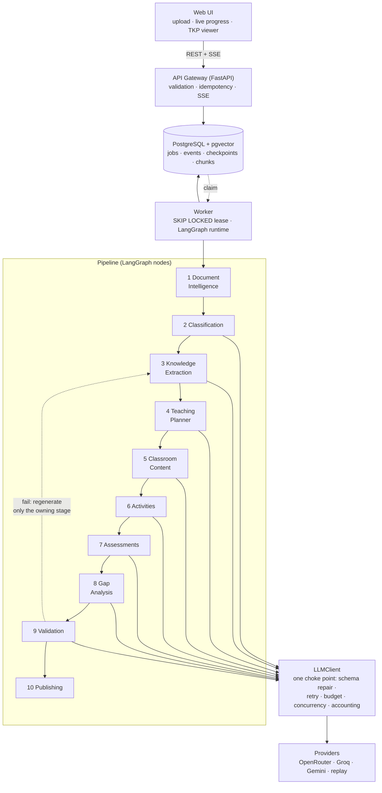

# EduForge AI

Turns a raw educational document — a PDF chapter, a DOCX, a slide deck, a text
file — into a **Teacher Knowledge Package (TKP)**: a structured, classroom-ready
artifact with a multi-period lesson plan, teacher scripts, activities,
assessments with answer keys and rubrics, learning-gap analysis, and a citation
back to the source for every factual claim it makes.

Built for the AI Engineer assignment (`Task Intern-2.pdf`), with the follow-up
clarifications in [`FAQ.md`](FAQ.md) folded into the design.

---

## Status

**First version, in progress.** Honest current state:

| Stage | Status |
|---|---|
| 1 · Document Intelligence | ✅ real — PDF/DOCX/PPTX/TXT, structure-preserving |
| 2 · Educational Classification | ✅ real — verified live |
| 3 · Knowledge Extraction | ✅ real — verified live, evidence-verified |
| 4–8 · Planning → Gap Analysis | 🟡 code written, not yet wired into the graph |
| 9 · Validation | 🟡 code written, not yet wired |
| 10 · Publishing | 🟡 fonts only (multilingual PDF rendering not written) |
| Orchestration, worker, SSE API | ✅ real, end-to-end |
| Frontend | 🟡 scaffold + API/SSE client |
| Deployment | ⛔ not yet |

Stages not yet wired run as **stubs returning reference fixtures**, so the
pipeline walks end to end today and each stage is swapped in independently.

`make check` — **167 tests, lint clean, schema drift clean.**

---

## Quick start

Requires Python 3.12+. On Windows, run everything through WSL.

```bash
git clone <this repo> && cd EduForge-AI

python3 -m venv .venv
./.venv/bin/python -m pip install -U pip
./.venv/bin/python -m pip install -e "backend[dev]"

cp .env.example .env      # then add ONE provider key (see below)

make check                # lint + tests + schema drift  → should be all green
```

### Configure a provider

Put a key in `.env` and select a profile:

```bash
LLM_PROFILE=production          # OpenRouter free models — the default
Open_Router_API_KEY=sk-or-...
```

Get a free key at [openrouter.ai](https://openrouter.ai/keys). The default
profile uses only `:free` models, so a full run costs **$0.00**.

| `LLM_PROFILE` | Provider | Use |
|---|---|---|
| `production` | OpenRouter (free models) | Graded output, demo, end-to-end runs |
| `dev` | OpenRouter (smallest model) | Fast single-stage iteration |
| `groq` | Groq | Alternative; free tier caps at 8000 TPM |
| `gemini_dev` | Gemini | Alternative |
| `ci` | replay | Recorded cassettes — no network, no key |

Anthropic is implemented but **disabled by default**: a key in the environment is
not sufficient, you must also set `ALLOW_ANTHROPIC=true`. Billing against that
key should be a decision, not a config typo.

### Run the API

```bash
make dev      # or: ./.venv/bin/python -m uvicorn api.main:app --reload --app-dir backend
```

- API docs: <http://localhost:8000/api/v1/docs>
- Health: <http://localhost:8000/healthz>

```bash
# upload → enqueue → watch progress → read the package
curl -F "file=@chapter.pdf" localhost:8000/api/v1/documents
curl -X POST localhost:8000/api/v1/jobs -H 'Content-Type: application/json' \
     -d '{"document_id":"<id>"}'
curl -N localhost:8000/api/v1/jobs/<job_id>/events        # SSE progress
curl localhost:8000/api/v1/packages/<package_id>          # the TKP
```

### Common commands

```bash
make help          # list targets
make test          # full suite
make check         # what CI runs: schema drift + lint + boundaries + tests
make boundaries    # import-linter: a stage importing a stage fails here
make lint / fmt    # ruff
make schema        # regenerate the published JSON Schema + fixtures
```

There is no separate worker command. Until the Postgres store lands, an
in-memory store cannot be shared across processes, so the API enqueues the job
and drives it itself as a background task — `make dev` runs the whole system.

---

## Architecture



This is the target architecture. Today the store is in-memory and the API drives
the worker in-process; the Postgres box is the interface everything is already
written against, not something running. See **Known limitations**.

Full set in [`docs/`](docs/): SRS, HLD, LLD, data model, agent graph, API spec,
roadmap, risk analysis, per-module Definition of Done.

### Orchestration

**LangGraph** owns topology, state reduction, and conditional retry edges.
Model calls inside nodes go through our own `LLMClient` wrapping each provider's
SDK — not a generic LLM wrapper — so structured outputs, prompt caching, and
exact token accounting survive.

The graph is built from the stage roster rather than hand-wired, so a stage
cannot be added and forgotten in the graph. Checkpointing is ours, not
LangGraph's built-in saver: one source of truth for "what has this job
completed" beats two that can disagree at minute nine of a twelve-minute run.

### Five decisions that shape everything

1. **Modular monolith with enforced internal boundaries**, not ten microservices.
   `make boundaries` (in `make check`) fails the build if one stage imports
   another, if anything imports *into* `contracts`, or if a layer reaches upward.
   85% of the grade is output quality; the mandatory live prototype is the real
   delivery risk. Boundaries keep the option of splitting later without paying
   for distribution now.

2. **Evidence spans are mandatory from stage 3.** `Grounded.evidence` has
   `min_length=1`, so an ungrounded claim is *unconstructable*. This makes
   hallucination detection and RAG traceability one subsystem instead of two
   half-built ones.

3. **Citations are verified deterministically** before any judge model runs.
   Claims quoting text their cited chunk does not contain are dropped — free,
   and it stops a fabrication propagating through six downstream stages.

4. **`pedagogy_profile` routing.** Stage 2 classifies content as
   quantitative / conceptual / narrative / procedural / mixed; that value selects
   prompts, activity weights, assessment mix, *and the validation ruleset*. **No
   code anywhere branches on a subject name** — a test greps for it and fails the
   build. This is why a poetry chapter and a physics chapter take the same path.

5. **Durable jobs + persisted event log with SSE replay.** The pipeline outlives
   the HTTP request, a browser refresh, and a worker restart.

---

## What the pipeline produces

`TeacherKnowledgePackage.json` — classification, knowledge base (objectives,
concepts, definitions, formulae, examples, misconceptions, concept dependency
graph), multi-period teaching plan, per-period classroom content, activities,
assessment bank with rubrics, learning gaps, validation report, and provenance.

Plus Lesson Plan / Teacher Guide / Assessment Book PDFs and a Markdown bundle.

Schema: [`backend/contracts/schema/tkp-1.0.0.json`](backend/contracts/schema/tkp-1.0.0.json)
— generated from the Pydantic models and CI-checked for drift.

### Adaptive, not templated

Period count is **derived** from concept load, depth, and period duration —
never a fixed 5. Absent content is correct content: a history chapter yields
**zero formulae and zero numerical questions**, and the validator is
profile-conditioned so it passes rather than flagging a gap.

Verified live on the free tier:

| Document | Subject | Profile | Concepts | Formulae | Misconceptions |
|---|---|---|---|---|---|
| `physics.pdf` | Physics | quantitative | 3 | 1 | 2 |
| `history.docx` | History | narrative | 6 | **0** | 2 |

---

## Repository layout

```
backend/
  contracts/      frozen Pydantic models + published JSON Schema (imports nothing else)
  core/           LLM client & providers, storage, progress, config
  stages/         s1…s10, one package each — never import one another
  pedagogy/       profile registry: prompt emphasis, activity weights, validation rules
  orchestration/  LangGraph topology, state, checkpointing
  worker/         job execution and resume
  api/            FastAPI routes incl. resumable SSE
  tests/          contract · unit · integration, with real document fixtures
frontend/         React + Vite (served as static assets by the API — single origin)
config/models.yaml  per-stage model routing per profile
docs/             SRS, HLD, LLD, data model, agent graph, API spec, roadmap, risks, DoD
```

---

## Testing

```bash
make check
```

The suite makes **no live API calls** — a stub adapter serves canned responses,
so it is free, offline, and deterministic. Document fixtures are *real* generated
PDF/DOCX/PPTX files, because parser behaviour against synthetic input proves
nothing.

Tests worth knowing about:

- Corrupted TKPs must trip each validation rule class — a validator only ever
  tested on good input is indistinguishable from `return "pass"`.
- Kill the worker mid-run; the job resumes at the first incomplete stage and does
  not re-bill completed ones.
- Cut the SSE stream, reconnect with `Last-Event-ID`, assert the halves join
  exactly — no gap, no duplicate.
- A narrative package with zero formulae is asserted **valid**.

---

## Known limitations

- **Stages 4–10 are not wired in yet.** Written but running as stubs.
- **Not deployed.** The mandatory live URL is outstanding.
- Storage is in-memory; the Postgres implementation sits behind the same
  interface and is not written yet.
- Scanned PDFs are rejected with a clear error rather than OCR'd.
- Quality is bounded by free-tier models. Per-stage routing in
  `config/models.yaml` is the single place to upgrade.

---

## License

Assignment submission. Noto fonts under the SIL Open Font License.
