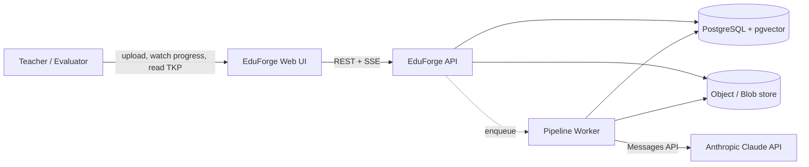

# EduForge AI — Software Requirements Specification (SRS)

**Version:** 1.0 · **Status:** proposed, pending approval · **Date:** 2026-07-30

---

## 1. Purpose & Scope

EduForge AI ingests a raw educational document (PDF, DOCX, PPTX, TXT/MD) and produces a
**Teacher Knowledge Package (TKP)** — a structured, classroom-ready teaching artifact covering
document intelligence, educational classification, knowledge extraction, multi-period lesson
planning, per-period classroom content, activities, assessments, learning-gap analysis, automated
validation, and multi-format publishing.

**In scope:** the 10-stage pipeline, streaming progress, validation, publishing (JSON + PDF),
evaluation UI, deployment, and all six bonus tracks.

**Out of scope (v1):** LMS integration, student-facing surfaces, teacher accounts/auth beyond a
demo access gate, collaborative editing, payment.

## 2. Stakeholders

| Actor | Goal |
|-------|------|
| Teacher (primary user) | Turn a chapter into teachable material in one upload |
| Evaluator (assessor) | Open a live URL, upload a document from any subject, judge output quality |
| Operator (us) | Run the service cheaply, observe failures, cap cost |

## 3. System Context

## 4. Functional Requirements

### 4.1 Ingestion (FR-01, FR-02, NFR-09, H-13, H-14, H-15)

- **SRS-1.1** Accept `application/pdf`, `.docx`, `.pptx`, `.txt`, `.md` by content sniffing, not by
  file extension alone.
- **SRS-1.2** Enforce limits: ≤ 25 MB, ≤ 300 pages/slides, parse timeout 90 s. Violations return
  `422` with a machine-readable reason.
- **SRS-1.3** Compute SHA-256 on upload; identical content returns the existing `document_id`.
- **SRS-1.4** Produce a `StructuredDocument`: ordered blocks typed as `heading | paragraph | list |
  table | figure_caption | equation | code`, each with `page`, `section_path`, `block_id`, and
  character offsets.
- **SRS-1.5** Detect equations and normalise to LaTeX where recoverable; preserve raw text as
  fallback. Tables are emitted as `{headers[], rows[][]}`, never flattened to a string.
- **SRS-1.6** Extract file metadata (title, author, created date, page count, detected language).
- **SRS-1.7** Chunk the structured document section-aware: target 800 tokens, 120-token overlap,
  never splitting a table or equation block. Each chunk records `chunk_id`, `page`, `section_path`.
- **SRS-1.8** No content from an uploaded file is ever executed, and macro-bearing formats are
  parsed with macros disabled.

### 4.2 Educational Classification (FR-03, H-07, BR-03)

- **SRS-2.1** Emit `subject`, `grade_band`, `difficulty`, `topic`, `chapter`, `category`,
  `language` (BCP-47), each with a `confidence` in `[0,1]`.
- **SRS-2.2** Emit `pedagogy_profile ∈ {quantitative, conceptual, narrative, procedural, mixed}`.
  This value is the routing key for every downstream prompt strategy and for the validation ruleset.
- **SRS-2.3** Emit optional `curriculum_alignment`: `{board, mapped_standards[], confidence}` for
  CBSE / ICSE / Common Core when the content matches a known standard; absent when it does not.
  Never fabricate a standard code.
- **SRS-2.4** When confidence for any field < 0.5, mark it `low_confidence` and surface it in the UI
  rather than silently proceeding.

### 4.3 Knowledge Extraction (FR-04, NFR-05, H-05, H-06, H-09)

- **SRS-3.1** Extract, as typed lists: `learning_objectives`, `prerequisites`, `concepts`,
  `definitions`, `formulae`, `keywords`, `examples`, `applications`, `misconceptions`.
- **SRS-3.2** **Every** item in `concepts`, `definitions`, `formulae`, `examples`, `applications`,
  `misconceptions` carries `evidence: [{chunk_id, page, quote}]` with ≥ 1 entry. An item without
  evidence is dropped at stage validation, not passed downstream.
- **SRS-3.3** Learning objectives carry a Bloom's-taxonomy level and are phrased as observable
  behaviours.
- **SRS-3.4** Emit `concept_graph`: nodes = concept ids; edges = `{from, to, relation:
  prerequisite_of | part_of | contrasts_with}`. The `prerequisite_of` subgraph must be acyclic;
  cycles are broken by dropping the lowest-confidence edge and recorded as a validation warning.
- **SRS-3.5** For documents exceeding the single-call budget, extraction runs map-reduce over
  sections with a deduplicating merge keyed on normalised concept name.

### 4.4 Teaching Planner (FR-05, H-08, H-09)

- **SRS-4.1** Accept `period_duration_minutes` (default 40) and optional `target_period_count`.
- **SRS-4.2** When `target_period_count` is absent, derive it from concept count and depth, bounded
  to `[1, 20]`. Never hardcode 5.
- **SRS-4.3** Assign each concept to exactly one period, in an order consistent with a topological
  sort of the `prerequisite_of` DAG.
- **SRS-4.4** Each period carries: `period_no`, `title`, `objectives[]` (subset of Stage 3
  objectives, by id), `concept_ids[]`, `time_allocation[]` summing to the period duration ± 5 %,
  and `sequence_rationale`.
- **SRS-4.5** Every Stage 3 learning objective is mapped to ≥ 1 period; unmappable objectives are
  reported, not dropped silently.

### 4.5 Classroom Content, Activities, Assessments, Gaps (FR-06 … FR-09)

- **SRS-5.1** Per period generate: `entry_ticket`, `teacher_script[]` (timed segments),
  `blackboard_notes`, `activity_refs[]`, `checkpoint_questions[]`, `exit_ticket`, `homework`,
  `mentor_moment`.
- **SRS-5.2** `mentor_moment` is a short motivational anecdote tied to the period's concepts; it is
  explicitly permitted to draw on general knowledge and is flagged `grounded: false` so validation
  does not penalise it.
- **SRS-5.3** Activities carry `type ∈ {demonstration, role_play, experiment, group_discussion,
  think_pair_share, problem_set, field_task, simulation, debate, gallery_walk}`, plus
  `duration_minutes`, `materials[]`, `teacher_instructions[]`, `success_criteria[]`,
  `differentiation {support, extension}`. Across a package, ≥ 3 distinct types must appear when
  period count ≥ 3.
- **SRS-5.4** Activity type selection is conditioned on `pedagogy_profile` — a `narrative` profile
  favours debate/role-play, a `quantitative` profile favours problem sets and experiments.
- **SRS-5.5** Assessments contain `mcqs[]` (4 options, exactly one correct, distractors traceable to
  a misconception where possible), `short_answer[]`, `long_answer[]`, and `numerical[]`.
  `numerical[]` may be empty when `pedagogy_profile` is `narrative` — this is valid.
- **SRS-5.6** Every assessment item carries `answer`, `marks`, `bloom_level`, `concept_ids[]`, and a
  `rubric` for non-MCQ items.
- **SRS-5.7** Learning-gap items carry `misconception`, `concept_ids[]`, `severity ∈ {low, medium,
  high}`, `diagnostic_questions[]`, `remediation[]`, and `evidence` where derived from the document.

### 4.6 Validation (FR-10, H-04, H-06, H-07, H-09)

- **SRS-6.1** **Schema conformance** — the assembled TKP validates against the published JSON Schema.
- **SRS-6.2** **Coverage** — every extracted concept appears in ≥ 1 period; every objective maps to
  ≥ 1 period and ≥ 1 assessment item.
- **SRS-6.3** **Consistency** — no concept introduced in two periods; no concept taught before its
  prerequisite; period durations within tolerance; `activity_refs` resolve.
- **SRS-6.4** **Grounding** — for each groundable claim, verify the cited chunk supports it, via
  lexical overlap pre-filter then an LLM judge on the survivors. Emit `grounding_score ∈ [0,1]` and
  an `unsupported_claims[]` list.
- **SRS-6.5** **Domain-conditional rules** — required-field checks are selected by `pedagogy_profile`
  (SRS-2.2). No rule may require formulae or numerical items unconditionally.
- **SRS-6.6** Outcome is `pass | pass_with_warnings | fail`. On `fail`, the orchestrator performs
  **targeted regeneration** of only the offending stage(s), max 2 attempts, then publishes with
  `status: pass_with_warnings` and a visible issue list rather than failing the job outright.

### 4.7 Publishing (FR-11, FR-12, FR-13, H-11, H-12)

- **SRS-7.1** Emit `TeacherKnowledgePackage.json` conforming to the published schema, versioned by
  `schema_version`.
- **SRS-7.2** Render three PDFs — **Lesson Plan**, **Teacher Guide**, **Assessment Book** — via
  HTML→PDF with embedded Unicode (Noto) fonts, rendering LaTeX equations and tables correctly.
- **SRS-7.3** Also emit a Markdown bundle (cheap, diff-friendly, useful for review).
- **SRS-7.4** Artifacts are addressable, downloadable, and listed on the package endpoint.
- **SRS-7.5** ≥ 2 pre-generated sample TKPs (one STEM, one humanities) ship in `/samples` and are
  browsable from the UI with no pipeline run.

### 4.8 Progress Streaming (FR-14, H-01, H-02)

- **SRS-8.1** `GET /api/v1/jobs/{job_id}/events` is a Server-Sent Events stream.
- **SRS-8.2** Each event payload **must** contain the keys `stage` (string) and `progress`
  (integer 0–100), matching the PDF's stated shape exactly. Additional keys (`message`, `ts`,
  `substage`, `seq`) are permitted.
- **SRS-8.3** Events are persisted with a monotonic `seq`. The endpoint honours the `Last-Event-ID`
  header and replays from that cursor, so a reconnecting client loses nothing.
- **SRS-8.4** A heartbeat comment is emitted every 15 s to defeat proxy idle timeouts.
- **SRS-8.5** Terminal events are `completed` or `failed`; both close the stream.

### 4.9 Job Lifecycle (H-01, H-03, H-10, H-15, NFR-06)

- **SRS-9.1** States: `queued → running → (succeeded | failed | cancelled)`, with
  `current_stage` and `progress` on the job row.
- **SRS-9.2** Stage outputs are checkpointed. `POST /jobs/{id}/retry` resumes from the first
  incomplete stage; completed stages are not re-executed or re-billed.
- **SRS-9.3** A job carries a token budget. Before each model call the projected spend is checked;
  on exhaustion the job halts, publishes whatever is complete, and reports `budget_exhausted`.
- **SRS-9.4** Model-call concurrency is bounded by a configurable semaphore; 429/5xx are retried
  with exponential backoff and jitter, max 4 attempts.
- **SRS-9.5** `POST /jobs` accepts `Idempotency-Key`; a repeat returns the existing job.

## 5. Non-Functional Requirements

| ID | Requirement | Acceptance |
|----|-------------|-----------|
| NFR-01 | Domain versatility | Golden set of ≥ 8 documents across ≥ 6 subjects (physics, mathematics, biology, history, literature, economics) all reach `pass` or `pass_with_warnings` |
| NFR-02 | Durability | Kill the worker mid-run; on restart the job resumes from the last checkpointed stage |
| NFR-03 | Progress latency | Stage-transition event visible to client ≤ 5 s |
| NFR-04 | Structured-output reliability | ≥ 99 % of stage calls yield schema-valid output within one repair attempt (measured over the golden set) |
| NFR-05 | Traceability | 100 % of groundable knowledge items carry ≥ 1 evidence span |
| NFR-06 | Cost control | Per-job token budget enforced; median job cost recorded and reported |
| NFR-07 | Availability | Health endpoint responds ≤ 5 s cold; samples render with zero LLM calls |
| NFR-08 | Concurrency | 3 concurrent jobs complete without error |
| NFR-09 | Upload safety | Malformed/oversized/zip-bomb fixtures rejected cleanly with `422`, never a 500 or a hang |
| NFR-10 | Injection resistance | Adversarial-instruction fixture does not alter system behaviour; instruction text appears only as extracted content |
| NFR-11 | Observability | Every job has a trace id; per-stage duration, tokens, cost, and attempt count are queryable |
| NFR-12 | Reproducibility | Same document + same config + same schema version produces a structurally equivalent TKP (same period count, same concept set ± ordering) |

## 6. Constraints & Assumptions

- **C-1** Model provider is the Anthropic Claude API via the official `anthropic` Python SDK.
  Default model `claude-opus-5` for every reasoning stage; the model is configurable **per stage**
  via `config/models.yaml` so the operator can trade cost for depth without code changes.
- **C-2** Orchestration is **LangGraph** (satisfies BR-01 and the PDF's request to name the
  orchestration framework). Model calls inside nodes go through our own `LLMClient` wrapping the
  Anthropic SDK — not through a generic LLM abstraction — so we keep structured outputs, adaptive
  thinking, prompt caching, and token accounting.
- **C-3** Single datastore: PostgreSQL with `pgvector` and full-text search. No separate vector DB,
  no separate queue broker in v1 — the job queue is a Postgres table using `SELECT … FOR UPDATE SKIP
  LOCKED`. Fewer moving parts is the correct trade at this scale.
- **C-4** Dense embeddings are **optional and pluggable** (`EMBEDDINGS=none|local|api`). BM25 over
  Postgres FTS is the always-available baseline, so a memory-constrained deployment degrades
  gracefully rather than failing.
- **C-5** Deployment target: a single container running API + worker, fronted by one URL, with the
  built frontend served as static assets from the API. Single origin removes an entire class of
  demo-day failures (CORS, mixed content, env-var drift).
- **C-6** Assumed available: an Anthropic API key with enough quota for ~120 calls per document run.

## 7. Acceptance Criteria for v1

1. A fresh evaluator opens the live URL, browses two sample TKPs immediately, uploads a document of
   their choosing, watches staged progress, and downloads a TKP JSON plus three PDFs.
2. Both a physics chapter (equations, numerical problems) and a literature chapter (narrative, no
   formulae) complete with `pass` or `pass_with_warnings`.
3. Refreshing the browser mid-run resumes the progress display without loss.
4. Killing the worker mid-run and restarting resumes the job without re-billing completed stages.
5. `/samples` contains ≥ 2 committed TKP JSON files, byte-identical to what the live system emits.
6. README carries setup instructions, the architecture diagram, and the orchestration explanation.
