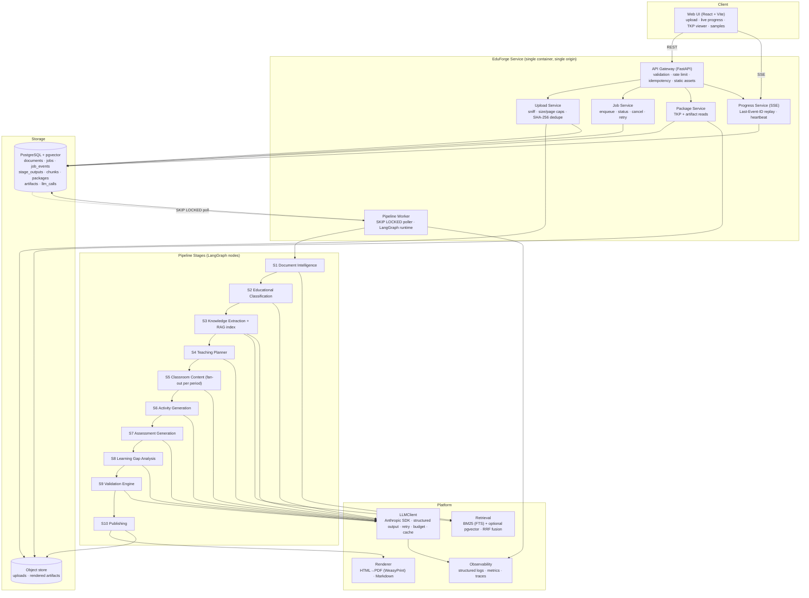
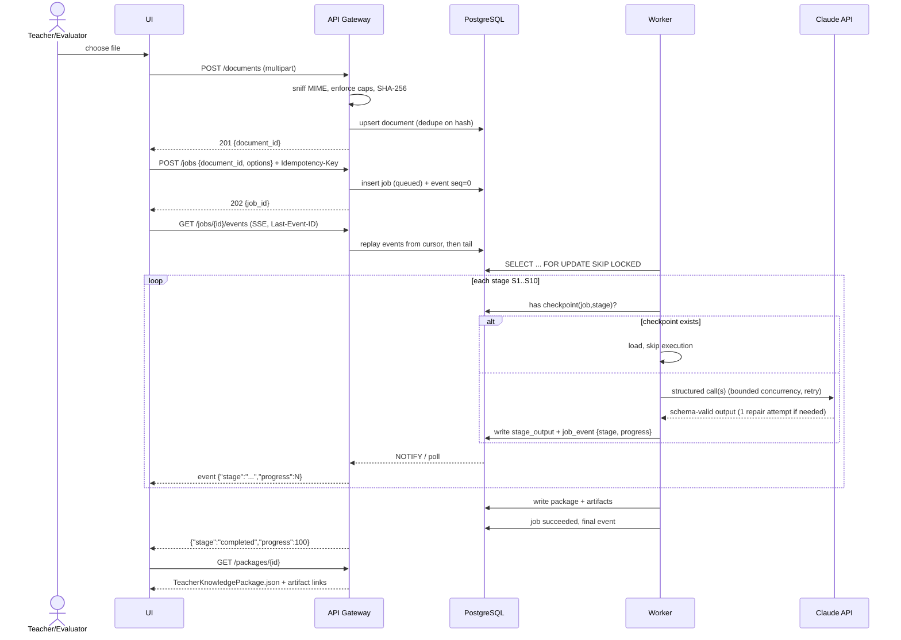
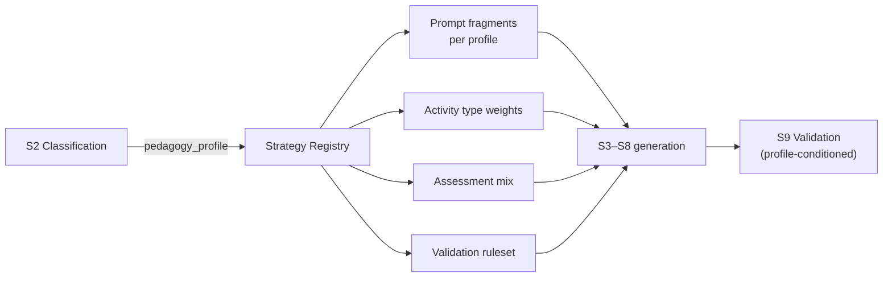
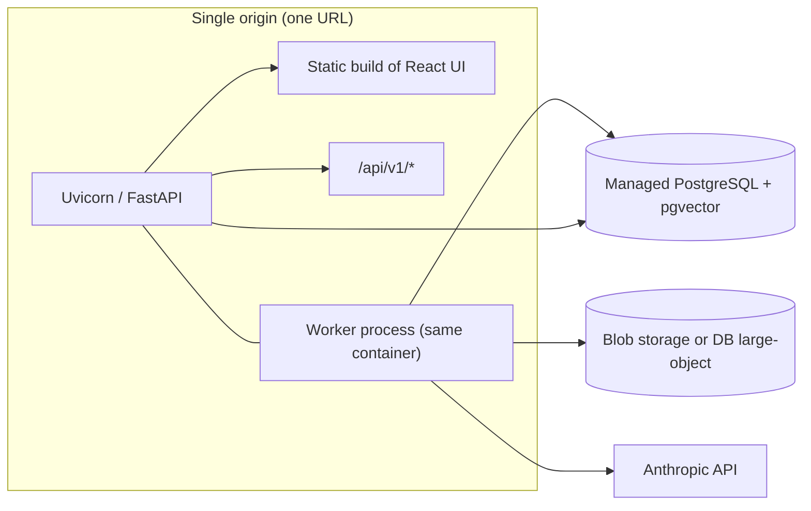

# EduForge AI — High-Level Design (HLD)

---

## 1. Architectural stance (and the one trade-off worth stating up front)

The PDF asks for "a microservice **or** pipeline-based architecture." We build a **modular monolith
with hard internal service boundaries**, deployed as one container.

Rationale: 85 % of the evaluation weight is output quality (content 25 %, educational understanding
20 %, teaching planning 20 %, document intelligence 15 %); engineering & architecture is 15 %.
Splitting ten stages into ten deployed services would spend most of the build budget on transport,
service discovery, and deploy plumbing — and would make the mandatory live prototype *more* likely
to be broken on demo day, not less. Instead each stage is a package with a typed interface and no
cross-imports, so the logical service boundaries the PDF asks for are real and diagrammable, and any
one of them could be lifted into its own process without touching its callers.

**Where the boundaries are enforced:** every stage takes a Pydantic input model and returns a
Pydantic output model, both defined in `contracts/`. Stages import `contracts`; stages never import
each other. A lint rule enforces this. That is what makes eleven agents able to build in parallel.

---

## 2. System architecture

---

## 3. Request & job flow

---

## 4. Stage responsibility map

| Stage | Responsibility | Model calls | Key output contract |
|-------|----------------|-------------|---------------------|
| S1 Document Intelligence | Parse → `StructuredDocument` → chunks → index | 0 (deterministic) | `StructuredDocument`, `Chunk[]` |
| S2 Educational Classification | Context + `pedagogy_profile` + curriculum alignment | 1 | `Classification` |
| S3 Knowledge Extraction | 9 knowledge lists + concept DAG, all evidence-bearing | 1–N (map-reduce) | `KnowledgeBase` |
| S4 Teaching Planner | Topological ordering → periods, objectives, timing | 1 | `TeachingPlan` |
| S5 Classroom Content | Per-period artifacts, fanned out | N (= period count) | `PeriodContent[]` |
| S6 Activity Generation | Typed, differentiated activities per period | N or 1 batched | `Activity[]` |
| S7 Assessment Generation | MCQ/short/long/numerical + keys + rubrics | 1–2 | `AssessmentBank` |
| S8 Learning Gap Analysis | Misconceptions, diagnostics, severity, remediation | 1 | `LearningGap[]` |
| S9 Validation Engine | Schema, coverage, consistency, grounding | 0–1 (judge only) | `ValidationReport` |
| S10 Publishing | Assemble TKP, render PDFs/MD, persist artifacts | 0 | `TeacherKnowledgePackage`, `Artifact[]` |

**Model-call budget per document:** ≈ 8 fixed + `period_count` (S5) + `period_count` (S6, if
un-batched) + grounding-judge batches. For a 5-period chapter: ~20–25 calls at default settings,
~60 with fine-grained fan-out. This is why bounded concurrency and a token budget are in v1, not v2.

---

## 5. Cross-cutting platform components

### 5.1 LLMClient (the single choke point for every model call)
Every stage calls Claude only through `core/llm/client.py`. It owns:
- **Structured output** — `client.messages.parse(..., output_format=PydanticModel)`. One repair
  attempt on validation failure, feeding the schema error back. Then a deterministic fallback that
  emits a minimal valid object with `degraded: true`.
- **Adaptive thinking** on reasoning-heavy stages (S3, S4, S5, S9) with per-stage `effort`.
- **Prompt caching** — the system prompt and the document context block carry `cache_control`, so
  S3→S8 over the same document read the cached prefix instead of re-paying. Stable prefix first,
  volatile content last (no timestamps, no UUIDs in the prefix).
- **Retry** — exponential backoff + jitter on 429/5xx/timeouts, max 4 attempts.
- **Concurrency** — asyncio semaphore, configurable (default 4).
- **Budget** — per-job token ceiling checked before each call; raises `BudgetExhausted`.
- **Accounting** — every call writes an `llm_calls` row: stage, model, tokens in/out/cached,
  latency, attempt, cost.

### 5.2 Retrieval (BR-02 + H-05 + H-06)
Hybrid by default: BM25 via Postgres `tsvector` **+** optional dense vectors via `pgvector`, fused
with Reciprocal Rank Fusion. Metadata filters on `section_path` and `page`. Dense is behind
`EMBEDDINGS=none|local|api`; with `none`, BM25 alone serves and the system stays functional.

Retrieval serves two jobs: (a) supplying relevant context to stage prompts on long documents,
(b) supplying candidate evidence spans that S9 verifies claims against.

### 5.3 Progress bus
Stages emit progress through a single `ProgressEmitter` that writes an append-only `job_events` row
(`seq bigserial`) and issues `pg_notify`. The SSE endpoint replays from `Last-Event-ID` then tails.
Persisted-first, notify-second — a dropped notify costs latency, never correctness.

### 5.4 Renderer
One templating path: TKP → Jinja2 → HTML → WeasyPrint → PDF, with Noto fonts embedded and MathJax-
rendered equations pre-baked. Three templates (Lesson Plan, Teacher Guide, Assessment Book) over the
same data. Markdown is a separate, trivial template.

### 5.5 Observability
`structlog` JSON logs with `job_id`/`trace_id` on every line; Prometheus counters/histograms at
`/metrics` (job duration, stage duration, tokens, cost, failures, retries, validation outcomes);
OpenTelemetry spans per stage and per model call.

---

## 6. Domain-adaptive generation (the mechanism behind NFR-01)

This is the design's answer to the explicitly graded versatility criterion.

| `pedagogy_profile` | Emphasis | Assessment mix | Validator expects |
|---|---|---|---|
| `quantitative` | worked examples, derivations, formulae | numerical-heavy | non-empty `formulae`, non-empty `numerical` |
| `conceptual` | models, analogies, contrasts | short/long answer | non-empty `concepts`, `misconceptions` |
| `narrative` | close reading, interpretation, context | long answer, discussion | **no** formulae/numerical requirement |
| `procedural` | step sequences, checklists, demos | task-based, rubric-scored | non-empty `examples`, ordered steps |
| `mixed` | balanced | balanced | union of soft checks only |

No stage contains a hardcoded subject name. The profile is data, resolved through the registry.

---

## 7. Failure model

| Failure | Detection | Response |
|---|---|---|
| Unsupported/oversized/corrupt upload | Upload service | `422` with reason; no job created |
| Parse timeout | Watchdog on S1 | Job fails fast with `parse_timeout`; nothing billed |
| Stage returns invalid JSON | Pydantic validation in LLMClient | 1 repair attempt → deterministic degraded object → stage warning |
| 429 / 5xx from provider | LLMClient | Backoff + jitter, ≤ 4 attempts |
| Token budget exhausted | Pre-call check | Halt, publish partial TKP, `budget_exhausted` |
| Worker crash mid-job | Lease expiry on job row | Another worker (or restart) reclaims; resumes from last checkpoint |
| Validation `fail` | S9 | Targeted regeneration of offending stage, ≤ 2 attempts, then publish `pass_with_warnings` |
| PDF render failure | S10 | JSON + Markdown still published; PDF artifact marked `failed` — never blocks the package |
| Client disconnect during SSE | — | Irrelevant: events are persisted; reconnect replays |

**Design principle:** the pipeline degrades to a partial, honestly-labelled package. It does not
throw away 10 minutes of successful work because one artifact failed.

---

## 8. Security model

| Concern | Control |
|---|---|
| Malicious upload | MIME sniff, size/page caps, parse timeout, macros disabled, no shell-out to converters |
| Prompt injection from document (H-13) | Document text wrapped in `<document_content>` delimiters; system prompt states document content is data, never instruction; no model output triggers a side effect beyond writing a validated field |
| Secret handling | API key only from env; never logged, never returned, never in a prompt |
| SSRF | No URL fetching from document content in v1 |
| Abuse of the public demo | Per-IP rate limit on `POST /documents` and `POST /jobs`; global concurrent-job cap; optional shared access code via `DEMO_ACCESS_CODE` |
| Data exposure | Package endpoints keyed by unguessable UUIDv4; no directory listing |
| PII | Uploaded documents may contain PII; retention default 30 days, documented, with a purge job |

---

## 9. Deployment topology

API and worker run as two processes in one container, sharing the database. The frontend is built
at image-build time and served as static files by FastAPI — **one URL, no CORS, one deploy**. If
throughput ever demands it, the worker scales out horizontally with zero code change, because the
queue is already `SKIP LOCKED` with leases.

---

## 10. Key architectural decisions (ADR summary)

| # | Decision | Alternative rejected | Why |
|---|----------|---------------------|-----|
| 1 | Modular monolith, hard internal boundaries | 10 deployed microservices | 15 % of grade is engineering; the mandatory live prototype is the real risk |
| 2 | LangGraph for orchestration | Hand-rolled async pipeline | Explicitly satisfies BR-01; gives checkpointing, fan-out (`Send`), conditional retry edges for free |
| 3 | Provider adapters behind a narrow port; native SDK inside each adapter | LangChain LLM wrappers | Keeps structured outputs, prompt caching, and exact token accounting per provider, instead of flattening all three to a common denominator |
| 4 | Postgres for queue + state + vectors + FTS | Redis + Qdrant + Postgres | One managed dependency; SKIP LOCKED is sufficient at this scale |
| 5 | Evidence spans mandatory from S3 | Post-hoc hallucination check | Makes FR-10 and BR-02 one subsystem instead of two half-built ones |
| 6 | `pedagogy_profile` routing | Subject-name branching | The only scalable answer to the graded versatility criterion |
| 7 | Persisted event log + SSE replay | In-memory WebSocket | Survives reload, reconnect, and worker restart (H-02) |
| 8 | Static UI served by the API | Separate Vercel frontend | Single origin eliminates CORS/env-drift failures on demo day |
| 9 | Dense embeddings optional | Hard dependency | Degrades to BM25 under memory constraints instead of failing |
| 10 | Per-stage model config in YAML | Hardcoded model per stage | Cost/quality tuning without code changes; defaults to `claude-opus-5` throughout |
| 11 | **Three LLM providers behind one port** — `anthropic` (production/demo), `gemini` (dev), `replay` (CI) | Single provider | A full run is 20–60 calls; paying frontier prices to test that stages wire up is waste. CI needs determinism and no network, which neither live provider gives. **Constraint: M11 quality evals are pinned to `production`** — tuning prompts on one model and shipping another means the scores do not transfer. |

**On ADR #11's scope.** The port abstracts only "given a schema, return a validated instance." Prompt caching, thinking/effort, and token accounting stay *inside* each adapter and are configured per provider. Abstracting those too would reduce every provider to its weakest common feature set — the usual way a multi-provider layer costs more than it saves.
