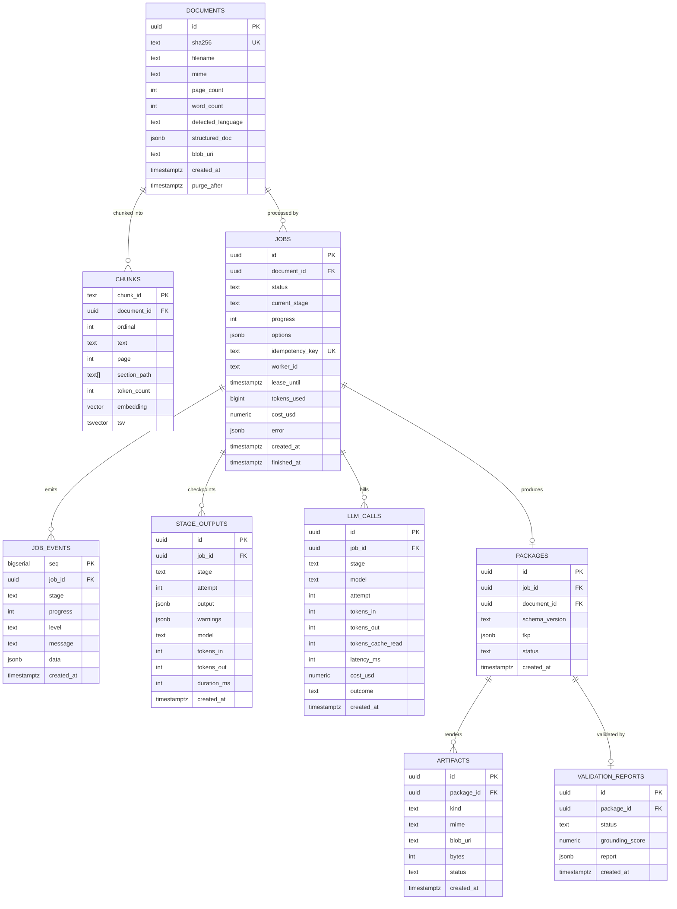

# EduForge AI — Data Model

**Engine:** PostgreSQL 16 + `pgvector` + built-in full-text search.
One datastore serves relational state, the job queue, the event log, the vector index, and BM25.

---

## 1. ER diagram



---

## 2. DDL

```sql
CREATE EXTENSION IF NOT EXISTS "pgcrypto";
CREATE EXTENSION IF NOT EXISTS vector;

-- ---------------------------------------------------------------- documents
CREATE TABLE documents (
    id                 uuid PRIMARY KEY DEFAULT gen_random_uuid(),
    sha256             text NOT NULL UNIQUE,
    filename           text NOT NULL,
    mime               text NOT NULL,
    size_bytes         integer NOT NULL,
    page_count         integer,
    word_count         integer,
    detected_language  text,
    structured_doc     jsonb,                 -- StructuredDocument
    blob_uri           text NOT NULL,
    created_at         timestamptz NOT NULL DEFAULT now(),
    purge_after        timestamptz NOT NULL DEFAULT now() + interval '30 days'
);
CREATE INDEX ON documents (purge_after);

-- --------------------------------------------------------------------- jobs
CREATE TYPE job_status AS ENUM
    ('queued','running','succeeded','succeeded_partial','failed','cancelled');

CREATE TABLE jobs (
    id               uuid PRIMARY KEY DEFAULT gen_random_uuid(),
    document_id      uuid NOT NULL REFERENCES documents(id) ON DELETE CASCADE,
    status           job_status NOT NULL DEFAULT 'queued',
    current_stage    text,
    progress         smallint NOT NULL DEFAULT 0 CHECK (progress BETWEEN 0 AND 100),
    options          jsonb NOT NULL DEFAULT '{}'::jsonb,  -- period_duration, language, board, target_periods
    idempotency_key  text UNIQUE,
    worker_id        text,
    lease_until      timestamptz,
    tokens_used      bigint NOT NULL DEFAULT 0,
    cost_usd         numeric(10,4) NOT NULL DEFAULT 0,
    error            jsonb,
    created_at       timestamptz NOT NULL DEFAULT now(),
    started_at       timestamptz,
    finished_at      timestamptz
);
-- the queue index: claimable rows only
CREATE INDEX jobs_claimable_idx ON jobs (created_at)
    WHERE status IN ('queued','running');

-- --------------------------------------------------------------- job_events
CREATE TABLE job_events (
    seq        bigserial PRIMARY KEY,           -- doubles as the SSE event id
    job_id     uuid NOT NULL REFERENCES jobs(id) ON DELETE CASCADE,
    stage      text NOT NULL,
    progress   smallint NOT NULL CHECK (progress BETWEEN 0 AND 100),
    level      text NOT NULL DEFAULT 'info',    -- info | warning | error
    message    text,
    data       jsonb NOT NULL DEFAULT '{}'::jsonb,
    created_at timestamptz NOT NULL DEFAULT now()
);
CREATE INDEX job_events_job_seq_idx ON job_events (job_id, seq);

-- ------------------------------------------------------------ stage_outputs
CREATE TABLE stage_outputs (
    id          uuid PRIMARY KEY DEFAULT gen_random_uuid(),
    job_id      uuid NOT NULL REFERENCES jobs(id) ON DELETE CASCADE,
    stage       text NOT NULL,
    attempt     smallint NOT NULL DEFAULT 1,
    output      jsonb NOT NULL,
    warnings    jsonb NOT NULL DEFAULT '[]'::jsonb,
    model       text,
    tokens_in   integer DEFAULT 0,
    tokens_out  integer DEFAULT 0,
    duration_ms integer,
    created_at  timestamptz NOT NULL DEFAULT now(),
    UNIQUE (job_id, stage, attempt)
);
-- exactly one live checkpoint per (job, stage)
CREATE UNIQUE INDEX stage_outputs_current_idx
    ON stage_outputs (job_id, stage)
    WHERE attempt = 1;   -- superseded attempts are written with attempt > 1

-- ------------------------------------------------------------------- chunks
CREATE TABLE chunks (
    chunk_id     text PRIMARY KEY,
    document_id  uuid NOT NULL REFERENCES documents(id) ON DELETE CASCADE,
    ordinal      integer NOT NULL,
    text         text NOT NULL,
    page         integer,
    section_path text[] NOT NULL DEFAULT '{}',
    token_count  integer NOT NULL,
    block_ids    text[] NOT NULL DEFAULT '{}',
    embedding    vector(384),                    -- NULL when EMBEDDINGS=none
    tsv          tsvector GENERATED ALWAYS AS (to_tsvector('simple', text)) STORED
);
CREATE INDEX chunks_doc_ordinal_idx ON chunks (document_id, ordinal);
CREATE INDEX chunks_tsv_idx         ON chunks USING gin (tsv);
CREATE INDEX chunks_embedding_idx   ON chunks USING hnsw (embedding vector_cosine_ops);

-- ----------------------------------------------------------------- packages
CREATE TABLE packages (
    id             uuid PRIMARY KEY DEFAULT gen_random_uuid(),
    job_id         uuid NOT NULL UNIQUE REFERENCES jobs(id) ON DELETE CASCADE,
    document_id    uuid NOT NULL REFERENCES documents(id) ON DELETE CASCADE,
    schema_version text NOT NULL,
    tkp            jsonb NOT NULL,
    status         text NOT NULL,     -- pass | pass_with_warnings | fail
    created_at     timestamptz NOT NULL DEFAULT now()
);
CREATE INDEX packages_tkp_subject_idx
    ON packages ((tkp -> 'classification' ->> 'subject'));

-- ---------------------------------------------------------------- artifacts
CREATE TABLE artifacts (
    id         uuid PRIMARY KEY DEFAULT gen_random_uuid(),
    package_id uuid NOT NULL REFERENCES packages(id) ON DELETE CASCADE,
    kind       text NOT NULL,   -- tkp_json | lesson_plan_pdf | teacher_guide_pdf
                                -- | assessment_book_pdf | markdown_bundle
    mime       text NOT NULL,
    blob_uri   text NOT NULL,
    bytes      integer,
    status     text NOT NULL DEFAULT 'ready',   -- ready | failed
    created_at timestamptz NOT NULL DEFAULT now(),
    UNIQUE (package_id, kind)
);

-- -------------------------------------------------------- validation_reports
CREATE TABLE validation_reports (
    id              uuid PRIMARY KEY DEFAULT gen_random_uuid(),
    package_id      uuid NOT NULL REFERENCES packages(id) ON DELETE CASCADE,
    status          text NOT NULL,
    grounding_score numeric(4,3),
    report          jsonb NOT NULL,
    created_at      timestamptz NOT NULL DEFAULT now()
);

-- ---------------------------------------------------------------- llm_calls
CREATE TABLE llm_calls (
    id                uuid PRIMARY KEY DEFAULT gen_random_uuid(),
    job_id            uuid REFERENCES jobs(id) ON DELETE CASCADE,
    stage             text NOT NULL,
    model             text NOT NULL,
    attempt           smallint NOT NULL DEFAULT 1,
    tokens_in         integer NOT NULL DEFAULT 0,
    tokens_out        integer NOT NULL DEFAULT 0,
    tokens_cache_read integer NOT NULL DEFAULT 0,
    latency_ms        integer,
    cost_usd          numeric(10,6) NOT NULL DEFAULT 0,
    outcome           text NOT NULL,   -- ok | repaired | degraded | refused | error
    created_at        timestamptz NOT NULL DEFAULT now()
);
CREATE INDEX llm_calls_job_idx ON llm_calls (job_id, created_at);
```

---

## 3. Hybrid retrieval query (BM25 + dense, RRF-fused)

```sql
WITH bm25 AS (
  SELECT chunk_id,
         row_number() OVER (ORDER BY ts_rank_cd(tsv, plainto_tsquery('simple', $1)) DESC) AS rnk
  FROM chunks
  WHERE document_id = $2 AND tsv @@ plainto_tsquery('simple', $1)
  LIMIT 50
),
dense AS (
  SELECT chunk_id,
         row_number() OVER (ORDER BY embedding <=> $3) AS rnk
  FROM chunks
  WHERE document_id = $2 AND embedding IS NOT NULL
  LIMIT 50
)
SELECT chunk_id, SUM(1.0 / (60 + rnk)) AS score
FROM (SELECT * FROM bm25 UNION ALL SELECT * FROM dense) u
GROUP BY chunk_id
ORDER BY score DESC
LIMIT $4;
```
With `EMBEDDINGS=none` the `dense` CTE is omitted and the query degrades to pure BM25 — same shape,
same call site, no branching in the caller.

---

## 4. TKP JSON Schema

The canonical schema is generated from the Pydantic models
(`TeacherKnowledgePackage.model_json_schema()`) and committed to
`contracts/schema/tkp-1.0.0.json`. It is a **build artifact checked into git** and a CI job fails the
build if the generated schema drifts from the committed one — that is how eleven agents stay in sync
without coordinating.

`schema_version` is semver: patch = docs only, minor = additive optional fields, major = breaking.
Packages record the version they were built against; the UI renders by version.

---

## 5. Retention & purge

- `documents.purge_after` defaults to `now() + RETENTION_DAYS`.
- A daily job deletes expired documents; cascades remove chunks, jobs, events, checkpoints,
  packages, and artifacts.
- Sample packages are exempt (flagged `is_sample = true`, added in the seed migration) so the demo
  never empties out.
