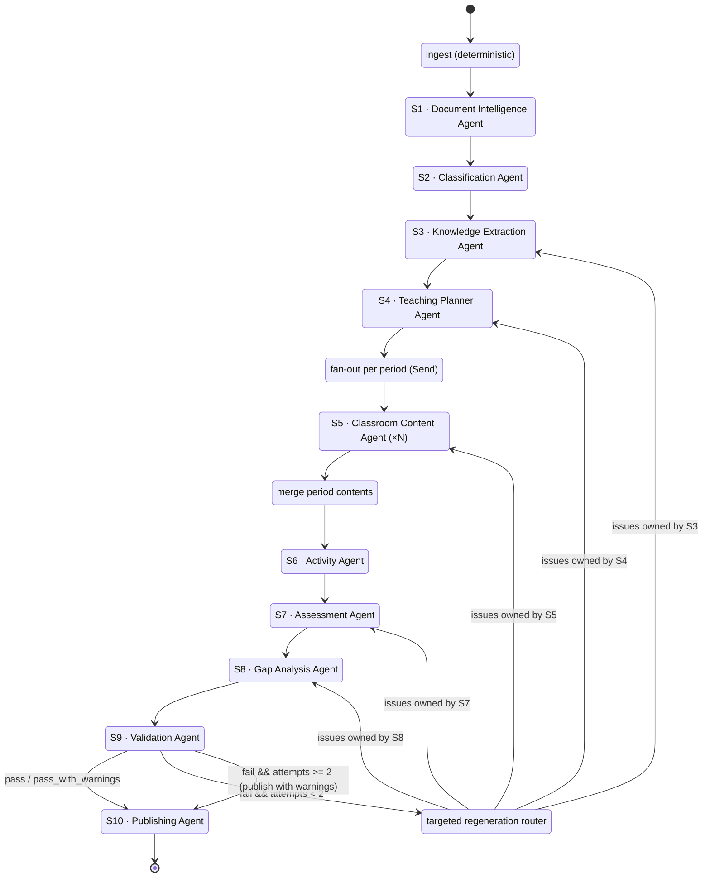

# EduForge AI — LangGraph Agent Graph

Satisfies **BR-01 (multi-agent orchestration with clear separation of responsibilities)** and is the
answer to the README's required "explanation of the AI orchestration framework used."

**Framework:** LangGraph for graph topology, state reduction, checkpointing, fan-out (`Send`), and
conditional retry edges. **Model calls inside nodes go through our own `LLMClient` wrapping the
official `anthropic` SDK** — not a generic LLM abstraction — so we keep typed structured outputs,
prompt caching, adaptive thinking, refusal handling, and exact token accounting.

---

## 1. Graph topology



`activities → assess → gaps` are drawn sequentially because they share the cached document prefix
and running them serially keeps the cache hot and the rate limit calm. They have **no data
dependency** on each other, so if wall-clock time becomes the binding constraint they can be
converted to a parallel branch by changing three edges and nothing else.

---

## 2. Agent roster and separation of responsibility

| Agent | Sole responsibility | Reads | Writes | Model |
|---|---|---|---|---|
| **Document Intelligence** | Turn bytes into typed structure. Zero interpretation. | upload blob | `structured_document`, `chunks` | none |
| **Classification** | Decide what *kind* of teaching material this is, incl. `pedagogy_profile` | doc summary + first/last chunks | `classification` | opus-5, effort medium |
| **Knowledge Extraction** | Build the evidence-bearing educational representation + concept DAG | chunks (retrieval), classification | `knowledge` | opus-5, effort high |
| **Teaching Planner** | Sequence concepts into periods respecting prerequisites and time | knowledge, classification, options | `teaching_plan` | opus-5, effort high |
| **Classroom Content** | Author one period's teaching material. One instance per period. | one period + its concepts + evidence | `period_contents[i]` | opus-5, effort high |
| **Activity** | Design differentiated, typed activities | plan, knowledge, profile | `activities` | opus-5, effort medium |
| **Assessment** | Build the item bank, keys, rubrics, blueprint | knowledge, plan, misconceptions | `assessments` | opus-5, effort high |
| **Gap Analysis** | Diagnose likely misconceptions and remediate | knowledge, assessments | `learning_gaps` | opus-5, effort medium |
| **Validation** | Judge the package. Authors nothing. | everything | `validation` | opus-5, effort low (judge only) |
| **Publishing** | Assemble and render. No model calls. | everything | `package`, `artifacts` | none |

The separation is enforced structurally: an agent can only read the state keys listed above (its
node signature takes a narrowed view), and only its own output key is writable.

---

## 3. Graph state

```python
class GraphState(TypedDict, total=False):
    # identity
    job_id: str
    document_id: str
    options: JobOptions                     # period_duration, language, board, target_periods

    # stage outputs
    structured_document: StructuredDocument
    chunks: list[Chunk]
    classification: Classification
    knowledge: KnowledgeBase
    teaching_plan: TeachingPlan
    period_contents: Annotated[list[PeriodContent], merge_by_period_no]   # reducer
    activities: list[Activity]
    assessments: AssessmentBank
    learning_gaps: list[LearningGap]
    validation: ValidationReport
    package: TeacherKnowledgePackage

    # control
    warnings: Annotated[list[Warning], operator.add]
    validation_attempts: int
    stages_to_regenerate: list[str]
    budget: BudgetState
```

`merge_by_period_no` is the fan-in reducer: it accepts out-of-order `Send` results and produces a
list sorted by `period_no`, replacing any duplicate `period_no` with the newest (which is what makes
targeted regeneration of a single period safe).

---

## 4. Fan-out (S5)

```python
def fanout_periods(state: GraphState) -> list[Send]:
    return [
        Send("period_content", {
            "job_id": state["job_id"],
            "period": p,
            "concepts": select_concepts(state["knowledge"], p.concept_ids),
            "objectives": select_objectives(state["knowledge"], p.objective_ids),
            "classification": state["classification"],
            "options": state["options"],
        })
        for p in state["teaching_plan"].periods
    ]
```

Each `period_content` invocation is a separate model call. Concurrency is bounded by the
`LLMClient` semaphore, not by LangGraph — one place owns rate limiting. Progress interpolates
across completions so the bar moves smoothly through the longest stage (weight 25).

**Per-period context is narrowed deliberately.** A period agent sees only its own concepts and
their evidence spans, not the whole knowledge base. That keeps the prompt small, keeps cache hits
high, and — more importantly — prevents a period from teaching material assigned to another period,
which is exactly the cross-period consistency failure S9 checks for.

---

## 5. Conditional edges

```python
def route_after_validation(state: GraphState) -> str:
    v = state["validation"]
    if v.status in ("pass", "pass_with_warnings"):
        return "publish"
    if state.get("validation_attempts", 0) >= 2:
        return "publish"                       # publish with warnings; never lose the work
    return "repair"

def route_repair(state: GraphState) -> list[Send]:
    owners = {i.stage for i in state["validation"].issues if i.severity == "error"}
    earliest = min(owners, key=STAGE_ORDER.index)
    return [Send(earliest, {**state, "correction_notes": issues_for(earliest, state)})]
```

Regeneration prompts receive the validation issues verbatim as correction instructions, so the
second attempt is informed rather than a blind resample.

---

## 6. Checkpointing & resumption

LangGraph's checkpointer is backed by our own `stage_outputs` table rather than a separate store, so
there is exactly one source of truth for "what has this job completed."

On worker start for a claimed job:
1. Load all `stage_outputs` for the job into initial state.
2. Compute the entry node as the first stage with no checkpoint.
3. Resume. Completed stages are neither re-executed nor re-billed (NFR-02, H-03).

A regeneration cycle writes `attempt = n+1` and demotes the prior row, so the full history of what
was regenerated and why stays auditable in the database.

---

## 7. Progress emission

Every node wraps its body in:

```python
async with ctx.stage_span("knowledge-extraction") as span:
    await span.progress(0)          # emits cumulative-before
    ...
    await span.progress(50, message="merging sections")
    ...
    # exit emits cumulative-after and persists the checkpoint atomically
```

The emitted payload always contains the two keys the assignment specifies:

```json
{"stage": "lesson-generation", "progress": 60, "message": "period 3 of 5", "seq": 42,
 "ts": "2026-07-30T18:04:11Z"}
```

---

## 8. Why LangGraph rather than a hand-rolled pipeline

| Need | LangGraph provides | Hand-rolled cost |
|---|---|---|
| Multi-agent separation (BR-01) | Nodes with narrowed state views | Convention only, unenforced |
| Per-period fan-out | `Send` + reducers | Custom gather + ordering logic |
| Resume after crash | Checkpointer protocol | Bespoke |
| Validation-driven retry | Conditional edges | Nested control flow that gets unreadable fast |
| Inspectable topology | Graph is a first-class object; renders to the README diagram | A diagram that drifts from the code |

The last row matters more than it looks: the architecture diagram in the README (DR-04) is
**generated from the graph**, so it cannot go stale.
