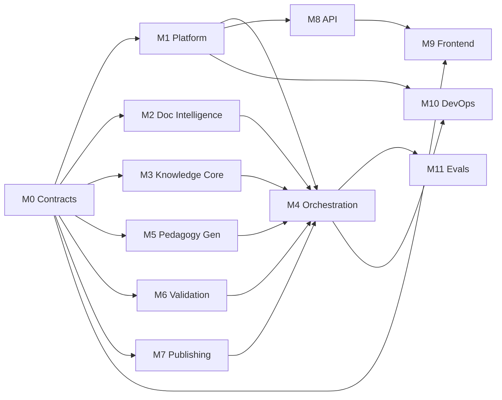

# EduForge AI — Development Roadmap

Twelve modules. **M0 is a hard serialization point**; after it, up to six agents work in parallel.

---

## 1. Module map

| ID | Module | Owns | Depends on | Parallel-safe with |
|----|--------|------|-----------|--------------------|
| **M0** | Contracts & Schema | `contracts/`, TKP JSON Schema, fixtures | — | *nothing — blocks all* |
| **M1** | Platform Foundation | `core/` (db, blob, config, logging, metrics, progress), migrations 0001 | M0 | M2 |
| **M2** | Document Intelligence | `stages/s1_*` | M0 | M3–M7, M9, M11 |
| **M3** | Knowledge Core | `stages/s2_*`, `stages/s3_*`, `core/retrieval/`, `pedagogy/` | M0, (M1 for retrieval) | M2, M4–M7, M9 |
| **M4** | Orchestration | `orchestration/`, `worker/`, `stages/base.py`, `core/llm/` | M0, M1 | M2, M3, M5–M7, M9 |
| **M5** | Pedagogy Generation | `stages/s4_*` … `s8_*` | M0, (M3 contracts) | M2, M6, M7, M9 |
| **M6** | Validation Engine | `stages/s9_*` | M0 | M2, M5, M7, M9 |
| **M7** | Publishing | `stages/s10_*`, renderers, templates, fonts | M0 | M2, M5, M6, M9 |
| **M8** | API Layer | `api/` incl. SSE | M0, M1 | M2, M5–M7, M9 |
| **M9** | Frontend | `frontend/` | M0 (+ M8 spec) | everything |
| **M10** | DevOps & Delivery | `deploy/`, CI, README, observability wiring | M1 | M2–M9 |
| **M11** | Eval Harness & Samples | `evals/`, `samples/` | M0 (+ full pipeline to run) | M2–M9 |

---

## 2. Milestones

### **MS-0 — Contract Freeze** *(blocking; do this alone, first)*
Deliver: every Pydantic model in `contracts/`, generated + committed TKP JSON Schema, one
hand-written *fixture TKP* that validates against it, and stub fixtures for every stage's input and
output.

**Gate:** `pytest tests/contract` green; the fixture TKP round-trips.
**Why it is worth being strict here:** every downstream agent codes against these fixtures instead of
against each other. A contract change after this point costs eleven rebases. Spend the extra hour.

### **MS-1 — Walking Skeleton** *(M1 + M4 + M8, thin)*
An end-to-end run where every stage is a stub returning its fixture, orchestrated by the real
LangGraph graph, driven by the real worker, observable over the real SSE endpoint.

**Gate:** `POST /documents` → `POST /jobs` → SSE emits all ten stages 0→100 → `GET /packages/{id}`
returns the fixture TKP. **No model calls anywhere.**
**This is the single most valuable milestone in the plan.** Once the skeleton walks, every remaining
module is a stub replacement that can be verified in isolation, and the mandatory deployment (DR-01)
is already provable.

### **MS-2 — Real Ingestion** *(M2)*
PDF/DOCX/PPTX/TXT parsing, structure preservation, equations, tables, chunking, safety caps.
**Gate:** all format fixtures parse; equation/table fixtures preserve structure; adversarial and
malformed fixtures rejected with `422`, never a 500 or a hang.

### **MS-3 — Real Understanding** *(M3)*
Classification (incl. `pedagogy_profile`, curriculum alignment), knowledge extraction with mandatory
evidence, concept DAG, retrieval index, pedagogy registry.
**Gate:** on the golden set, 100 % of groundable items carry evidence; the prerequisite subgraph is
acyclic; a physics doc and a poetry doc receive different profiles and neither errors.

### **MS-4 — Real Generation** *(M5)*
Planner, classroom content, activities, assessments, gaps — profile-conditioned throughout.
**Gate:** derived period counts vary sensibly across a 3-page handout and a 40-page chapter; ≥ 3
activity types on a 5-period package; a narrative document produces zero numerical items **and no
error**.

### **MS-5 — Real Validation & Publishing** *(M6 + M7)*
Full rule suite including grounding; targeted regeneration wired into the graph; TKP assembly and
three PDFs plus Markdown.
**Gate:** an intentionally corrupted TKP is caught by every rule class; a Hindi package renders PDFs
with correct glyphs (H-11); a forced render failure still publishes JSON.

### **MS-6 — Product Surface** *(M9 + M8 completion)*
Upload UI, live stage timeline, TKP viewer with evidence popovers, validation panel, samples gallery,
artifact downloads.
**Gate:** mid-run browser refresh resumes progress with no gap (H-02); samples render on a cold
container with zero model calls (H-12).

### **MS-7 — Deploy & Harden** *(M10)*
Container, migrations + sample seeding on boot, live URL, health/readiness, metrics, README with
generated architecture diagram.
**Gate:** DR-01 satisfied — a stranger with the URL can upload and receive a package. Worker killed
mid-run resumes correctly (NFR-02). Cold start under 5 s.

### **MS-8 — Quality Pass** *(M11)*
Golden-set eval across ≥ 6 subjects, rubric scoring, cost/latency report, prompt iteration against
measured results, `/samples` regenerated from the shipping build.
**Gate:** every golden document reaches `pass` or `pass_with_warnings`; ≥ 2 sample TKPs committed and
byte-identical to live output (DR-06).

---

## 3. Execution waves

| Wave | Runs in parallel | Ends at |
|---|---|---|
| **W0** | M0 alone | MS-0 |
| **W1** | M1, M4-skeleton, M8-skeleton, M9-scaffold | MS-1 |
| **W2** | M2, M3, M5, M6, M7 — five agents, disjoint directories | MS-2…MS-5 |
| **W3** | M8 completion, M9 completion, M10 | MS-6, MS-7 |
| **W4** | M11 + prompt tuning driven by eval results | MS-8 |

W2 is where the parallelism pays off, and it only works because of MS-0 and the import-boundary rule.
Each W2 agent develops against fixtures and a stubbed `LLMClient`, so none of them is blocked by
another's progress or by API quota.

---

## 4. Sequencing judgement calls

**Deploy at MS-1, not MS-7.** The deployment is mandatory (DR-01) and is the most common way a
submission of this shape fails. Standing it up while the pipeline is still stubs means the deploy
path is proven weeks before it carries anything valuable, and every later milestone ships to a URL
that already works.

**Evidence spans land in MS-3, not MS-5.** Retrofitting traceability after generation is written is
a rewrite of every extraction prompt. Making evidence a required contract field from M0 means it is
never optional.

**Prompt tuning is a milestone, not an activity.** MS-8 exists because 65 % of the grade is output
quality, and quality that is not measured does not improve. The eval harness is not optional polish.

**Frontend starts at W1 against the OpenAPI spec.** It does not wait for real data — the fixture TKP
from MS-0 is enough to build every view.

---

## 5. Cut list, in order (if time compresses)

Cut from the bottom. Nothing above the line may be cut — each item below the line is a bonus or a
nice-to-have, and each is severable without breaking anything else.

| Priority | Item | Consequence of cutting |
|---|---|---|
| — | *Everything in FR-01…FR-15, DR-01…DR-06* | **Never cut.** These are the assignment. |
| 1 | Dense embeddings (`EMBEDDINGS=none`) | Retrieval falls back to BM25; grounding still works |
| 2 | Markdown bundle artifact | One fewer download format |
| 3 | Curriculum alignment (BR-03) | Bonus lost; nothing else breaks |
| 4 | Multilingual output (BR-06) | Bonus lost; English path unaffected |
| 5 | OpenTelemetry tracing (keep logs + metrics) | Partial BR-05 |
| 6 | Targeted regeneration (keep validation reporting) | Validation reports but does not self-heal |
| 7 | Assessment Book as a separate PDF | Fold into Teacher Guide |
